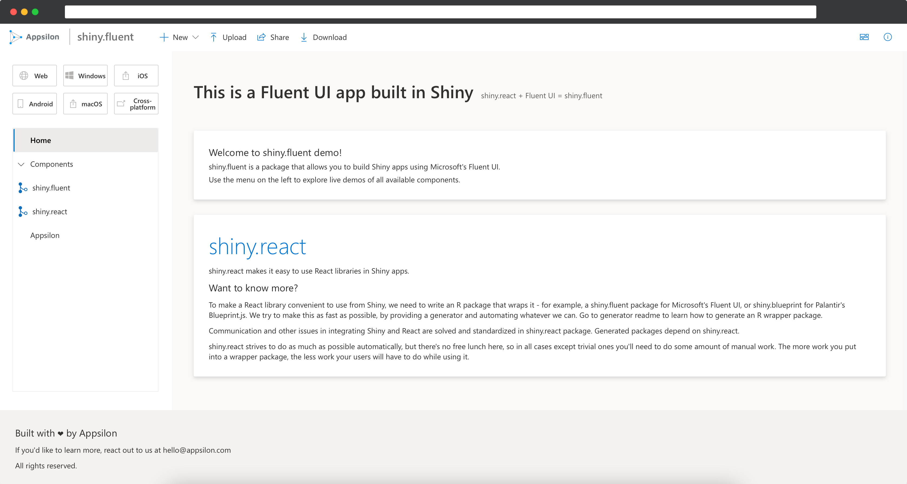

<!-- badges: start -->
[](https://github.com/Appsilon/shiny.fluent/actions)
<!-- badges: end -->

# shiny.fluent: Build beautiful Shiny apps using Microsoft's Fluent UI

We believe that a great UI plays a huge role in the success of application projects. shiny.fluent gives your apps:
- beautiful, professional look
- rich set of components easily usable in Shiny
- fast speed of development that Shiny is famous for.

As Fluent UI is built in React, shiny.fluent is based on another package called [shiny.react](https://github.com/Appsilon/shiny.react), which allows for using React libraries in Shiny.


## Getting started

The best place to start is the [Quick start](#quick-start) section below. You can then explore [tutorials](https://appsilon.github.io/shiny.fluent/articles/first-app.html), [examples](#examples), and [reference docs](https://appsilon.github.io/shiny.fluent/reference/index.html).
All of this is easily accessible on the [package's website](https://appsilon.github.io/shiny.fluent/)

### Installation

Currently the packages are only available from Github, and are private - you need to have access to these repositories.

```R
remotes::install_git("ssh://git@github.com/Appsilon/shiny.react.git")
remotes::install_git("ssh://git@github.com/Appsilon/shiny.fluent.git")
```

This should work out of the box, assuming you have SSH keys that authenticate you to GitHub in the standard path. If you run into issues, check the [Solving installation credentials issues](#solving-installation-credentials-issues) section.

### Quick start

Here's how to make an app containing a Fluent UI checkbox:

```r
shinyApp(
    ui = withReact(
      div(
        Checkbox("checkbox", FALSE),
        textOutput("checkboxValue")
      )
    ),
    server = function(input, output) {
      output$checkboxValue <- renderText({
        sprintf("Value: %s", input$checkbox)
      })
    }
  )
```

`shiny.fluent` provides all controls from [Fluent UI](https://developer.microsoft.com/en-us/fluentui#/controls/web). You can open that page or start typing `shiny.fluent::` in RStudio to see all available controls.

All components are documented, so if you run `?shiny.fluent::MyComponentName`, you'll see documentation for this component in RStudio, along with examples. When in doubt, open Fluent UI docs for details.

To insert Fluent components inside your Shiny app, wrap them inside a `withReact(...)` call, like above. Inside a `withReact` call, you can mix and match React and standard HTML tags. You can also insert other Shiny outputs inside (like a `uiOutput` or `leafletOutput`).

### Examples

**The easiest way to get started** is to look at an example dashboard. There's one you can look at immediately after installing the library: simply run `shiny.fluent::run_example("dashboard")`



There are also usage examples for individual components. For a list of all available examples, use `shiny.fluent::run_example()`.

## Solving installation credentials issues

_This section will be removed once the package is published_

If installation fails, configure Git credentials using `usethis::use_git_credentials` and `git2r::cred_ssh_key` or `git2r::cred_token`. This should help

If you run into errors with installing as above, try installing SSH dependencies and re-installing git2r

```sh
sudo apt-get install libssh2-1 libssh2-1-dev
Rscript -e 'remotes::install_cran("git2r", force = TRUE)'
```

For Mac OSX use:

```sh
brew install libssh2
brew install libgit2
install.packages("git2r", type = "source", configure.vars = "autobrew=yes")
```
