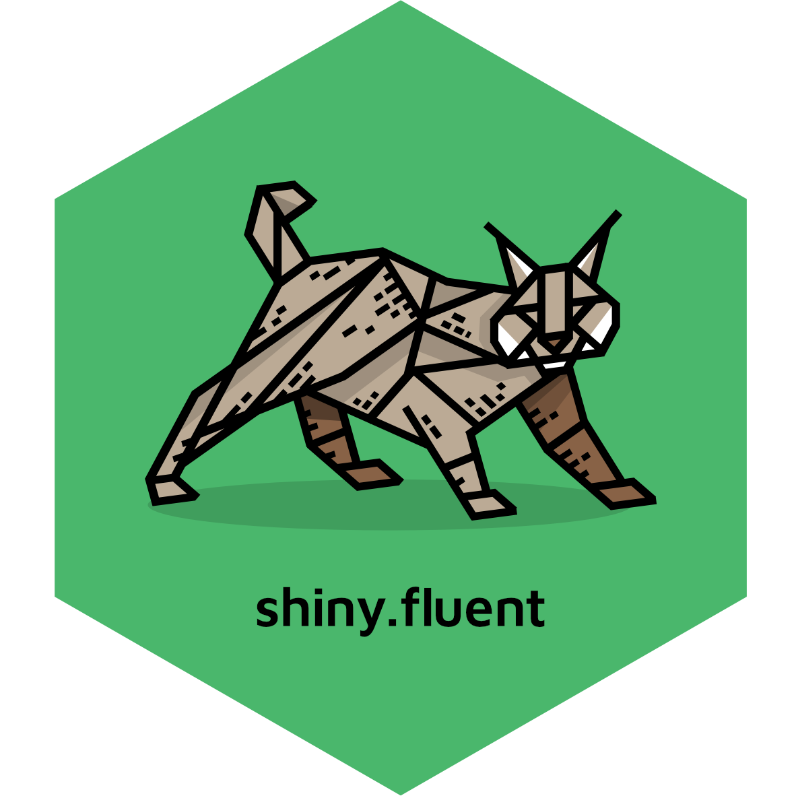

<a href = "https://appsilon.com/careers/" target="_blank"></a>




# shiny.fluent

<!-- badges: start -->
[](https://github.com/Appsilon/shiny.fluent/actions/workflows/ci.yml)
<!-- badges: end -->

We believe that a great UI plays a huge role in the success of application projects. shiny.fluent gives your apps:
- beautiful, professional look
- rich set of components easily usable in Shiny
- fast speed of development that Shiny is famous for.

As Fluent UI is built in React, shiny.fluent is based on another package called [shiny.react](https://github.com/Appsilon/shiny.react), which allows for using React libraries in Shiny.

> A big game-changer for companies already using Microsoft tools on a daily basis, because everyone is already familiar and pleased by the Microsoft UI.

**Note:** This package strives to be as easy to use as possible, while providing most of Fluent UI possibilities. That said, Fluent UI is more flexible and low level than Bootstrap, and there is additional complexity coming from using React in Shiny. You should expect using shiny.fluent to be somewhat more complex than vanilla Shiny or shiny.semantic (at some point you will likely want to browse the original Fluent UI documentation), but you get more power, flexibility and better UI in return.


## Getting started

### Installation

To install the packages, run:
```R
remotes::install_github("Appsilon/shiny.react")
remotes::install_github("Appsilon/shiny.fluent")
```

### Quick start

Here's how to make an app containing a Fluent UI checkbox:

```r
shinyApp(
    ui = div(
      Checkbox.shinyInput("checkbox", value = TRUE),
      textOutput("checkboxValue")
    ),
    server = function(input, output) {
      output$checkboxValue <- renderText({
        sprintf("Value: %s", input$checkbox)
      })
    }
  )
```

`shiny.fluent` provides all components from Microsoft's Fluent UI library.
Browse the [official docs](https://developer.microsoft.com/en-us/fluentui#/controls/web)
or start typing `shiny.fluent::` in RStudio to see all available controls.

All components are documented, so if you run `?shiny.fluent::MyComponentName`, you'll see documentation for this component in RStudio, along with examples. When in doubt, open Fluent UI docs for details.

### Examples

A good way to learn more is to look at the examples.
Once you install the library, you can run them with `shiny.fluent::runExample("example_name")`.
We recommend the following for starters:
* `demo`: a demo app for analyzing sales reps performance,
* `dashboard`: a showcase of all available components along with documentation.

There are also usage examples for individual components.
Use `shiny.fluent::runExample()` to list all available examples.

Appsilon
--------


Appsilon is the **Full Service Certified RStudio Partner**. Learn more
at [appsilon.com](https://appsilon.com).

Get in touch [support+opensource@appsilon.com](mailto:support+opensource@appsilon.com)
