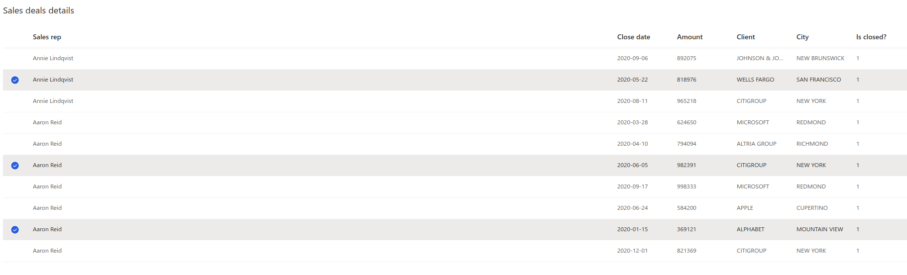
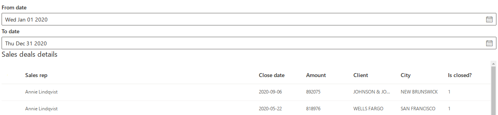
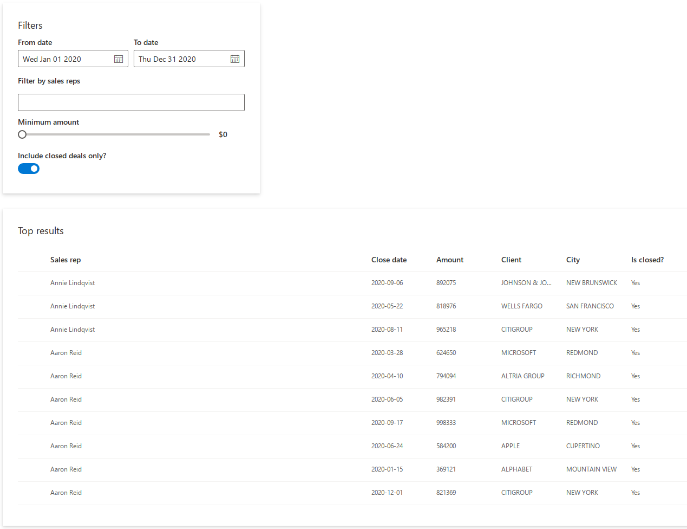
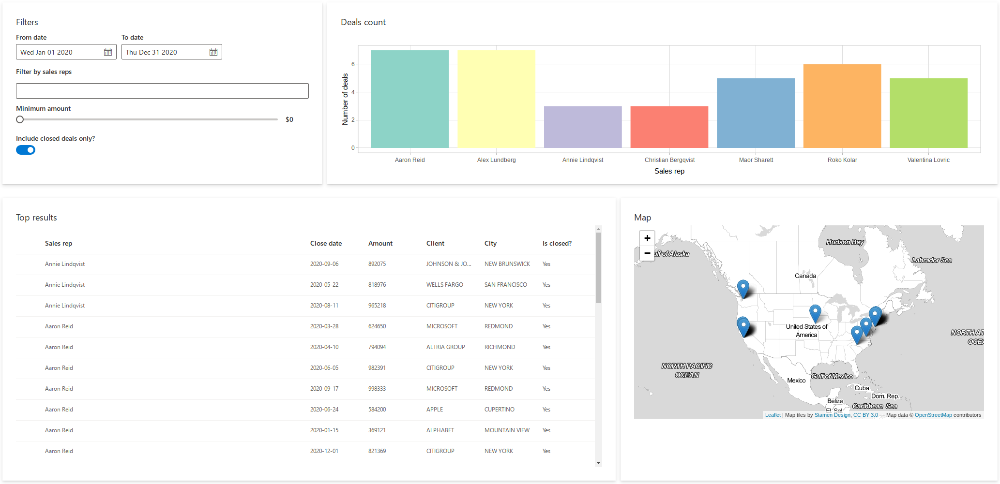

# Tutorial: Create your first shiny.fluent dashboard

Let’s learn shiny.fluent by building an example app.

In this tutorial, we’ll build a basic application for analysing sales
results data. The app will allow for filtering the data, and viewing it
on a plot, on a map and in a table.

We’ll assume that you have [Shiny](https://shiny.rstudio.com/) and
`shiny.fluent` [already
installed](https://appsilon.github.io/shiny.fluent/#installation).

## shiny.fluent “Hello world!” app

Let’s start by creating an app that shows “Hello world!”, but does this
with Fluent UI. First, we need to load `shiny.fluent`.

``` r
library(shiny)
library(shiny.fluent)
```

That gives us all we need to run a basic application! To create a UI
showing a welcome message, we will use a Fluent component named
[`?Text`](https://appsilon.github.io/shiny.fluent/reference/Text.md).
We’ll put it in a
[`?fluentPage`](https://appsilon.github.io/shiny.fluent/reference/fluentPage.md),
which will add proper CSS classes and suppress Bootstrap (you should not
use both Bootstrap and Fluent UI at the same time).

``` r
ui <- fluentPage(
  Text(variant = "xxLarge", "Hello world!")
)

server <- function(input, output, session) {}

shinyApp(ui, server)
```

Let’s see what our app looks like right now.


Yay! It may not look very impressive, but this text is rendered in Shiny
with the whole power of Fluent UI and [React](https://reactjs.org).

## Showing data in a table

Let’s now grab some data and show it to our users in a table.
shiny.fluent already includes some example data that we can use.

`fluentPeople` is a list of imaginary people in a format expected by
some Fluent components.

``` r
fluentPeople %>% glimpse()
#> Rows: 7
#> Columns: 11
#> $ key           <dbl> 1, 2, 3, 4, 5, 6, 7
#> $ imageUrl      <chr> "https://static2.sharepointonline.com/files/fabric/offic…
#> $ imageInitials <chr> "PV", "AR", "AL", "RK", "CB", "VL", "MS"
#> $ text          <chr> "Annie Lindqvist", "Aaron Reid", "Alex Lundberg", "Roko …
#> $ secondaryText <chr> "Senior Sales Rep", "Sales Rep", "Junior Sales Rep", "Se…
#> $ tertiaryText  <chr> "In a meeting", "In a meeting", "In a meeting", "In a me…
#> $ optionalText  <chr> "Available at 4:00pm", "Available at 4:00pm", "Available…
#> $ isValid       <lgl> TRUE, TRUE, TRUE, TRUE, TRUE, TRUE, TRUE
#> $ presence      <dbl> 2, 6, 4, 1, 2, 2, 3
#> $ canExpand     <lgl> NA, NA, NA, NA, NA, NA, NA
#> $ color         <chr> "#8DD3C7", "#FFFFB3", "#BEBADA", "#FB8072", "#80B1D3", "…
```

`fluentSalesData` is a data frame of randomly generated “sales deals”,
which are assigned to one of the `fluentPeople`, have a date and an
amount, and are associated with one of the top 10 companies from the
Fortune 500 list (including its name, city and map coordinates).

``` r
fluentSalesDeals %>% glimpse()
#> Rows: 100
#> Columns: 30
#> $ X           <dbl> -8286952, -13595427, -13625773, -13595427, -8286952, -8234…
#> $ Y           <dbl> 4938582, 6047180, 4550281, 6047180, 4938582, 4976415, 4938…
#> $ FID         <dbl> 493, 234, 425, 234, 493, 333, 493, 284, 333, 284, 425, 234…
#> $ OBJECTID    <dbl> 493, 234, 425, 234, 493, 333, 493, 284, 333, 284, 425, 234…
#> $ RANK        <dbl> 35, 28, 25, 28, 35, 21, 35, 26, 21, 26, 25, 28, 28, 21, 21…
#> $ NAME        <chr> "JOHNSON & JOHNSON", "MICROSOFT", "WELLS FARGO", "MICROSOF…
#> $ ADDRESS     <chr> "1 JOHNSON AND JOHNSON PLAZA", "1 MICROSOFT WAY", "420 MON…
#> $ ADDRESS2    <chr> "NOT AVAILABLE", "NOT AVAILABLE", "NOT AVAILABLE", "NOT AV…
#> $ CITY        <chr> "NEW BRUNSWICK", "REDMOND", "SAN FRANCISCO", "REDMOND", "N…
#> $ STATE       <chr> "NJ", "WA", "CA", "WA", "NJ", "NY", "NJ", "NC", "NY", "NC"…
#> $ ZIP         <chr> "08933", "98052", "94163", "98052", "08933", "10017", "089…
#> $ COUNTY      <chr> "MIDDLESEX", "KING", "SAN FRANCISCO", "KING", "MIDDLESEX",…
#> $ EMPLOYEES   <dbl> 126400, 114000, 269100, 114000, 126400, 243355, 126400, 20…
#> $ REVENUES    <dbl> 71890, 85320, 94176, 85320, 71890, 105486, 71890, 93662, 1…
#> $ LATITUDE    <dbl> 40.49804, 47.64005, 37.79340, 47.64005, 40.49804, 40.75598…
#> $ LONGITUDE   <dbl> -74.44296, -122.12980, -122.40240, -122.12980, -74.44296, …
#> $ SOURCE      <chr> "MANUAL", "BING MAPS", "BING MAPS", "BING MAPS", "MANUAL",…
#> $ PRC         <chr> "ON-ENTITY", "ADDRESS", "ADDRESS", "ADDRESS", "ON-ENTITY",…
#> $ COUNTYFIPS  <chr> "34023", "53033", "06075", "53033", "34023", "36061", "340…
#> $ COMMENTS    <chr> "NOT AVAILABLE", "NOT AVAILABLE", "NOT AVAILABLE", "NOT AV…
#> $ WEBSITE     <chr> "HTTPS://WWW.JNJ.COM/", "HTTPS://WWW.MICROSOFT.COM/EN-US/"…
#> $ PROFIT      <dbl> 16540, 16798, 21938, 16798, 16540, 24733, 16540, 17906, 24…
#> $ deal_amount <dbl> 855987, 753174, 702208, 590190, 405443, 714723, 455713, 80…
#> $ rep_id      <int> 1, 1, 1, 1, 1, 1, 1, 1, 1, 1, 1, 1, 1, 2, 2, 2, 2, 2, 2, 2…
#> $ rep_name    <chr> "Annie Lindqvist", "Annie Lindqvist", "Annie Lindqvist", "…
#> $ date        <date> 2020-02-19, 2020-08-18, 2020-10-14, 2020-02-23, 2020-10-1…
#> $ client_name <chr> "JOHNSON & JOHNSON", "MICROSOFT", "WELLS FARGO", "MICROSOF…
#> $ city        <chr> "NEW BRUNSWICK", "REDMOND", "SAN FRANCISCO", "REDMOND", "N…
#> $ color       <chr> "#8DD3C7", "#8DD3C7", "#8DD3C7", "#8DD3C7", "#8DD3C7", "#8…
#> $ is_closed   <int> 0, 1, 0, 0, 0, 0, 0, 1, 0, 0, 0, 0, 1, 0, 0, 1, 1, 1, 0, 1…
```

We now need a Fluent component to insert a table. A good way find a
component that suits our needs is to launch the showcase dashboard with
`shiny.fluent::runExample("dashboard")` or to visit the [official Fluent
UI docs](https://developer.microsoft.com/en-us/fluentui#/controls).
Browsing through the list of components, we find
[`?DetailsList`](https://appsilon.github.io/shiny.fluent/reference/DetailsList.md),
which gives a table component with rich configuration options.

First, we need to define which columns from our deals data we want to
see and how to label them.

``` r
details_list_columns <- tibble(
  fieldName = c("rep_name", "date", "deal_amount", "client_name", "city", "is_closed"),
  name = c("Sales rep", "Close date", "Amount", "Client", "City", "Is closed?"),
  key = fieldName)
```

Let’s now display our sales deals in a table. As we plan to later make
the table change dynamically, we put it in a regular Shiny `uiOutput`.
Let’s also assume that for now we want to filter out deals that have
`is_closed` equal to `1`.

``` r
ui <- fluentPage(
  uiOutput("analysis")
)

server <- function(input, output, session) {
  filtered_deals <- reactive({
    filtered_deals <- fluentSalesDeals %>% filter(is_closed > 0)
  })

  output$analysis <- renderUI({
    items_list <- if(nrow(filtered_deals()) > 0){
      DetailsList(items = filtered_deals(), columns = details_list_columns)
    } else {
      p("No matching transactions.")
    }

    Stack(
      tokens = list(childrenGap = 5),
      Text(variant = "large", "Sales deals details", block = TRUE),
      div(style="max-height: 500px; overflow: auto", items_list)
    )
  })
}

shinyApp(ui, server)
```

In addition to
[`?DetailsList`](https://appsilon.github.io/shiny.fluent/reference/DetailsList.md)
and
[`?Text`](https://appsilon.github.io/shiny.fluent/reference/Text.md), in
the code above we used
[`?Stack`](https://appsilon.github.io/shiny.fluent/reference/Stack.md),
which arranges elements in its area.



## Adding filtering

Okay, that already looks good! But it’s hard to explore these data
without some filtering options - let’s add that now. We will start by
adding an option to find transactions between selected dates.

We will use two
[`?DatePicker`](https://appsilon.github.io/shiny.fluent/reference/DatePicker.md)
components to allow users to choose a date range. To make the selected
dates available in the server function, we have two options:

1.  The simple way. Use the `DatePicker.shinyInput` convenience wrapper,
    which provides an interface analogous to vanilla Shiny inputs:
    `inputId` and optional `value`.
2.  The advanced way. Use the component directly and connect it to Shiny
    using its React interface: `onSelectDate` and `defaultValue` in this
    case.

The second option is less convenient but might provide more power and
flexibility in some cases. We’ll go with the first option in this
tutorial, as the simplified interface is sufficient for our needs.

``` r
filters <- tagList(
  DatePicker.shinyInput("fromDate", value = as.Date('2020/01/01'), label = "From date"),
  DatePicker.shinyInput("toDate", value = as.Date('2020/12/31'), label = "To date")
)
```

Let’s add the filters to our UI:

``` r
ui <- fluentPage(
  filters,
  uiOutput("analysis")
)
```

In the server function of our application, we can now access the input
values using the IDs we provided in the same way as with any other Shiny
input. Let’s use the selected dates to apply additional filtering to the
deals:

``` r
server <- function(input, output, session) {
  filtered_deals <- reactive({
    req(input$fromDate)
    filtered_deals <- fluentSalesDeals %>% filter(
      date >= input$fromDate,
      date <= input$toDate,
      is_closed > 0
    )
  })
```

This is what our application looks like now:



## More filters

Let’s add more filtering options to our app! We will use the following
components:

- [`?NormalPeoplePicker`](https://appsilon.github.io/shiny.fluent/reference/PeoplePicker.md)
  to limit the search to selected sales representatives,
- [`?Slider`](https://appsilon.github.io/shiny.fluent/reference/Slider.md)
  to define a minimum deal size,
- [`?Toggle`](https://appsilon.github.io/shiny.fluent/reference/Toggle.md)
  to show only the closed deals.

In addition we’ll use
[`?Stack`](https://appsilon.github.io/shiny.fluent/reference/Stack.md)
and
[`?Label`](https://appsilon.github.io/shiny.fluent/reference/Label.md)
to visually arrange the filtering controls.

``` r
filters <- Stack(
  tokens = list(childrenGap = 10),
  Stack(
    horizontal = TRUE,
    tokens = list(childrenGap = 10),
    DatePicker.shinyInput("fromDate", value = as.Date('2020/01/01'), label = "From date"),
    DatePicker.shinyInput("toDate", value = as.Date('2020/12/31'), label = "To date")
  ),
  Label("Filter by sales reps", className = "my_class"),
  NormalPeoplePicker.shinyInput(
    "selectedPeople",
    class = "my_class",
    options = fluentPeople,
    pickerSuggestionsProps = list(
      suggestionsHeaderText = 'Matching people',
      mostRecentlyUsedHeaderText = 'Sales reps',
      noResultsFoundText = 'No results found',
      showRemoveButtons = TRUE
    )
  ),
  Slider.shinyInput("slider",
    value = 0, min = 0, max = 1000000, step = 100000,
    label = "Minimum amount",
    valueFormat = JS("function(x) { return '$' + x}"),
    snapToStep = TRUE
  ),
  Toggle.shinyInput("closedOnly", value = TRUE, label = "Include closed deals only?")
)
```

Now that we have multiple filtering controls, it would be a good idea to
add some visual separation between them and the table. Let’s define a
helper function to create Fluent UI cards:

``` r
makeCard <- function(title, content, size = 12, style = "") {
  div(
    class = glue("card ms-depth-8 ms-sm{size} ms-xl{size}"),
    style = style,
    Stack(
      tokens = list(childrenGap = 5),
      Text(variant = "large", title, block = TRUE),
      content
    )
  )
}
```

Now we can wrap the filters in a call to `makeCard()`. Additionally, we
include a `style` tag to add some padding and margin to the cards
created by our helper function.

``` r
ui <- fluentPage(
  tags$style(".card { padding: 28px; margin-bottom: 28px; }"),
  makeCard("Filters", filters, size = 4, style = "max-height: 320px;"),
  uiOutput("analysis")
)
```

Let’s move our attention to the server function. We can access the
values of the filtering controls using the provided IDs just like
before.

``` r
server <- function(input, output, session) {
  filtered_deals <- reactive({
    req(input$fromDate)
    selectedPeople <- (
      if (length(input$selectedPeople) > 0) input$selectedPeople
      else fluentPeople$key
    )
    minClosedVal <- if (isTRUE(input$closedOnly)) 1 else 0

    filtered_deals <- fluentSalesDeals %>%
      filter(
        rep_id %in% selectedPeople,
        date >= input$fromDate,
        date <= input$toDate,
        deal_amount >= input$slider,
        is_closed >= minClosedVal
      ) %>%
      mutate(is_closed = ifelse(is_closed == 1, "Yes", "No"))
  })
```

Finally, let’s refactor the table output and wrap it in a card.

``` r
    makeCard("Top results", div(style="max-height: 500px; overflow: auto", items_list))
```

Our filtering is much more useful now!



## More outputs

We are not limited to shiny.fluent components - we can seamlessly use
other libraries in our app! Let’s add a Plotly plot and a Leaflet map.
We start by adding a `plotlyOutput()` to our UI:

``` r
ui <- fluentPage(
  tags$style(".card { padding: 28px; margin-bottom: 28px; }"),
  Stack(
    tokens = list(childrenGap = 10), horizontal = TRUE,
    makeCard("Filters", filters, size = 4, style = "max-height: 320px"),
    makeCard("Deals count", plotlyOutput("plot"), size = 8, style = "max-height: 320px")
  ),
  uiOutput("analysis")
)
```

We also add a `leafletOutput()` to the UI generated in the server
function:

``` r
    Stack(
      tokens = list(childrenGap = 10), horizontal = TRUE,
      makeCard("Top results", div(style="max-height: 500px; overflow: auto", items_list)),
      makeCard("Map", leafletOutput("map"))
    )
```

Now we can add the following code to the server function to render a bar
chart and a map:

``` r
  output$map <- renderLeaflet({
    points <- cbind(filtered_deals()$LONGITUDE, filtered_deals()$LATITUDE)
    leaflet() %>%
      addProviderTiles(providers$Stamen.TonerLite, options = providerTileOptions(noWrap = TRUE)) %>%
      addMarkers(data = points)
  })

  output$plot <- renderPlotly({
    p <- ggplot(filtered_deals(), aes(x = rep_name)) +
      geom_bar(fill = unique(filtered_deals()$color)) +
      ylab("Number of deals") +
      xlab("Sales rep") +
      theme_light()
    ggplotly(p, height = 300)
  })
```

Look at our dashboard now!



## The end result

In this tutorial we built a simple dashboard for exploring sales
representatives data. We learned how to use shiny.fluent inputs and
outputs, how to add components from other libraries and how to use
Fluent UI capabilities for visually arranging the elements.
