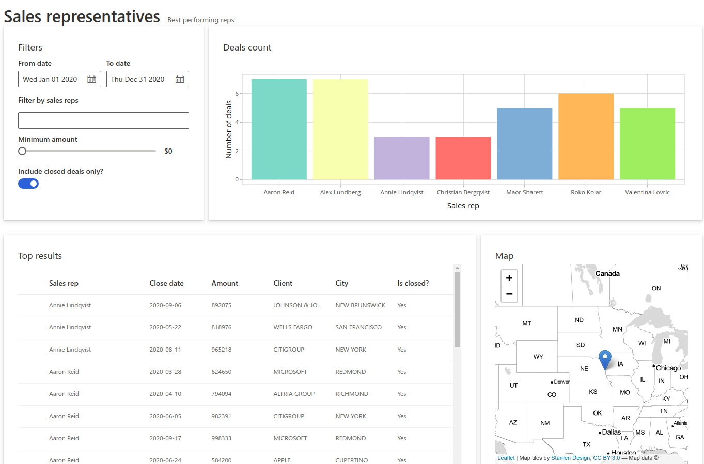
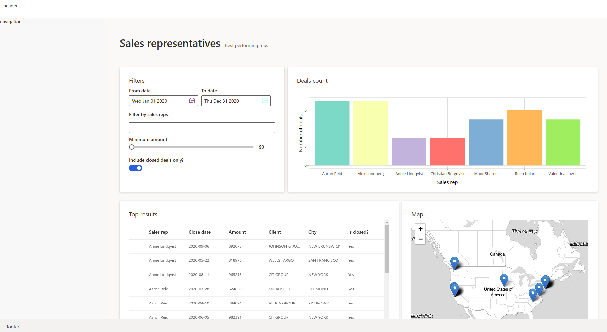

# Tutorial: Full dashboard UI in Shiny and Fluent

``` r
library(shiny.fluent)
```

This is Part 2 of shiny.fluent tutorial.

In [Part
1](https://appsilon.github.io/shiny.fluent/articles/shiny-fluent.md) we
built a pretty functional app, but honestly, it doesn’t look
particularly great. Let’s now build a good looking dashboard UI for that
app. It will have a top command bar with a title, a sidebar with
navigation, and multiple pages handled by router.

## Prerequisites

We are starting with the [code Part 1 ends
with](https://appsilon.github.io/shiny.fluent/articles/shiny-fluent.html).

Let’s start by changing the beginning of our file to load all libraries
that we will use in this example. Make sure to install the ones you
don’t have yet installed (if any).

``` r
library(dplyr)
library(ggplot2)
library(glue)
library(leaflet)
library(plotly)
library(sass)
library(shiny)
library(shiny.fluent)
library(shiny.router)
```

## Single page layout

As a next step, let’s add a title and subtitle to our current app. We’ll
create a helper function and call it `makePage`, so that it is easy to
add more pages in the same fashion.

``` r
makePage <- function (title, subtitle, contents) {
  tagList(div(
    class = "page-title",
    span(title, class = "ms-fontSize-32 ms-fontWeight-semibold", style =
           "color: #323130"),
    span(subtitle, class = "ms-fontSize-14 ms-fontWeight-regular", style =
           "color: #605E5C; margin: 14px;")
  ),
  contents)
}
```

We can now take our entire UI built so far and put it in a “page”
layout, giving it a helpful title and subtitle.

``` r
analysis_page <- makePage(
  "Sales representatives",
  "Best performing reps",
  div(
    Stack(
      horizontal = TRUE,
      tokens = list(childrenGap = 10),
      makeCard("Filters", filters, size = 4, style = "max-height: 320px"),
      makeCard("Deals count", plotlyOutput("plot"), size = 8, style = "max-height: 320px")
    ),
    uiOutput("analysis")
  )
)

ui <- fluentPage(
  tags$style(".card { padding: 28px; margin-bottom: 28px; }"),
  analysis_page
)
```



## Dashboard Layout

It’s time to create a place for our header, navigation sidebar and
footer. We’ll use CSS grid for that. It’s a modern, flexible and
staightforward way to achieve such a layout.

We start by creating divs for each of the areas, with placeholder texts
that we will later replace.

``` r
header <- "header"
navigation <- "navigation"
footer <- "footer"

layout <- function(mainUI){
  div(class = "grid-container",
      div(class = "header", header),
      div(class = "sidenav", navigation),
      div(class = "main", mainUI),
      div(class = "footer", footer)
  )
}
```

Now it’s time to tell the browser using CSS how to arrange these areas.
To define how our areas should be laid out on the page, let’s put the
following rules in `www/style.css`:

``` css
.grid-container {
  display: grid;
  grid-template-columns: 320px 1fr;
  grid-template-rows: 54px 1fr 45px;
  grid-template-areas: "header header" "sidenav main" "footer footer";
  height: 100vh;
}

.header {
  grid-area: header;
  background-color: #fff;
  padding: 6px 0px 6px 10px;
  display: flex;
}

.main {
  grid-area: main;
  background-color: #faf9f8;
  padding-left: 40px;
  padding-right: 32px;
  max-width: calc(100vw - 400px);
  max-height: calc(100vh - 100px);
  overflow: auto;
}

.footer {
  grid-area: footer;
  background-color: #f3f2f1;
  padding: 12px 20px;
}

.sidenav {
  grid-area: sidenav;
  background-color: #fff;
  padding: 25px;
}
```

We can also use this opportunity to add some additional styling for the
entire page, and add the following rules to the same file:

``` css
body {
  background-color: rgba(225, 223, 221, 0.2);
  min-height: 611px;
  margin: 0;
}

.page-title {
  padding: 52px 0px;
}

.card {
  background: #fff;
  padding: 28px;
  margin-bottom: 28px;
  border-radius: 2px;
  background-clip: padding-box;
}
```

Now we only need to update our UI definition to load styles from
`www/style.css` and use the new layout.

``` r
ui <- fluentPage(
  layout(analysis_page),
  tags$head(
    tags$link(href = "style.css", rel = "stylesheet", type = "text/css")
  ))
```



## Filling all the areas

Great! Now it’s time to fill those areas with something. We can start
with the header.

### Header

Let’s replace the previous header definition with:

``` r
header <- tagList(
  img(src = "appsilon-logo.png", class = "logo"),
  div(Text(variant = "xLarge", "Sales Reps Analysis"), class = "title"),
  CommandBar(
    items = list(
      CommandBarItem("New", "Add", subitems = list(
        CommandBarItem("Email message", "Mail", key = "emailMessage", href = "mailto:me@example.com"),
        CommandBarItem("Calendar event", "Calendar", key = "calendarEvent")
      )),
      CommandBarItem("Upload sales plan", "Upload"),
      CommandBarItem("Share analysis", "Share"),
      CommandBarItem("Download report", "Download")
    ),
    farItems = list(
      CommandBarItem("Grid view", "Tiles", iconOnly = TRUE),
      CommandBarItem("Info", "Info", iconOnly = TRUE)
    ),
    style = list(width = "100%")))
```

As you can see, we’re using `CommandBar` and `CommandBarItem` from
shiny.fluent. We also need to add a bit of styling to our CSS file:

``` css
.title {
  padding: 0px 14px 0px 14px;
  color: #737373;
  margin: 6px 0px 6px 10px;
  border-left: 1px solid darkgray;
  width: 220px;
}

.logo {
  height: 44px;
}
```

### Navigation in the sidebar

`Nav` is a very powerful component from Fluent UI. It has very rich
configuration options, but we will use it to show just a couple of
links:

``` r
navigation <- Nav(
  groups = list(
    list(links = list(
      list(name = 'Home', url = '#!/', key = 'home', icon = 'Home'),
      list(name = 'Analysis', url = '#!/other', key = 'analysis', icon = 'AnalyticsReport'),
      list(name = 'shiny.fluent', url = 'http://github.com/Appsilon/shiny.fluent', key = 'repo', icon = 'GitGraph'),
      list(name = 'shiny.react', url = 'http://github.com/Appsilon/shiny.react', key = 'shinyreact', icon = 'GitGraph'),
      list(name = 'Appsilon', url = 'http://appsilon.com', key = 'appsilon', icon = 'WebAppBuilderFragment')
    ))
  ),
  initialSelectedKey = 'home',
  styles = list(
    root = list(
      height = '100%',
      boxSizing = 'border-box',
      overflowY = 'auto'
    )
  )
)
```

### Footer

Footer is relatively straightforward - we can put anything we want
there. Here we use `Text` for typography (setting uniform font styling).
We also use `Stack` to arrange elements horizontally and with bigger
gaps.

``` r
footer <- Stack(
  horizontal = TRUE,
  horizontalAlign = 'space-between',
  tokens = list(childrenGap = 20),
  Text(variant = "medium", "Built with ❤ by Appsilon", block=TRUE),
  Text(variant = "medium", nowrap = FALSE, "If you'd like to learn more, reach out to us at hello@appsilon.com"),
  Text(variant = "medium", nowrap = FALSE, "All rights reserved.")
)


layout <- function(mainUI){
  div(class = "grid-container",
      div(class = "header", header),
      div(class = "sidenav", navigation),
      div(class = "main", mainUI),
      div(class = "footer", footer)
  )
}

# ---
ui <- fluentPage(
  layout(analysis_page),
  tags$head(
    tags$link(href = "style.css", rel = "stylesheet", type = "text/css")
  ))
```

Let’s see how this looks together.


## Additional pages

### Home page

The one final step is to add additional pages. Let’s make a home page,
consisting of two cards with some welcome text.

``` r
card1 <- makeCard(
  "Welcome to shiny.fluent demo!",
  div(
    Text("shiny.fluent is a package that allows you to build Shiny apps using Microsoft's Fluent UI."),
    Text("Use the menu on the left to explore live demos of all available components.")
  ))

card2 <- makeCard(
  "shiny.react makes it easy to use React libraries in Shiny apps.",
  div(
    Text("To make a React library convenient to use from Shiny, we need to write an R package that wraps it - for example, a shiny.fluent package for Microsoft's Fluent UI, or shiny.blueprint for Palantir's Blueprint.js."),
    Text("Communication and other issues in integrating Shiny and React are solved and standardized in shiny.react package."),
    Text("shiny.react strives to do as much as possible automatically, but there's no free lunch here, so in all cases except trivial ones you'll need to do some amount of manual work. The more work you put into a wrapper package, the less work your users will have to do while using it.")
  ))

home_page <- makePage(
  "This is a Fluent UI app built in Shiny",
  "shiny.react + Fluent UI = shiny.fluent",
  div(card1, card2)
)
```

If we replace `analysis_page` with `home_page` in our `ui`, we can even
see this page. However, there’s one problem: we don’t have a way to
switch between pages! This is where so-called page routing comes into
play.

### Adding shiny.router

To enable switching between pages we will use the
[shiny.router](https://appsilon.github.io/shiny.router/) package. This
way we will also have shareable URLs to individual pages.

The first step is to define the available routes:

``` r
router <- router_ui(
  route("/", home_page),
  route("other", analysis_page)
)
```

Now, we need to put `router` in the place where we want the selected
page to appear.

``` r
ui <- fluentPage(
  layout(router),
  tags$head(
    tags$link(href = "style.css", rel = "stylesheet", type = "text/css")
  ))
```

One final step is to add this single line to our `server` function,
which otherwise remains untouched from the Part 1 of the tutorial.

``` r
  router_server()
```

## That’s it!

That’s it - we have styled a shiny.fluent app into a solid dashboard
layout!
