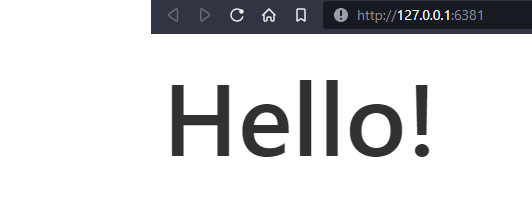
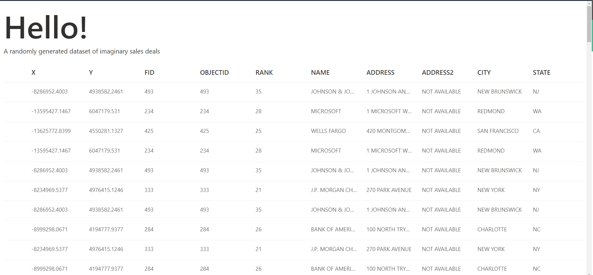
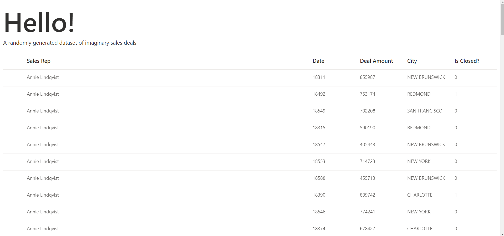
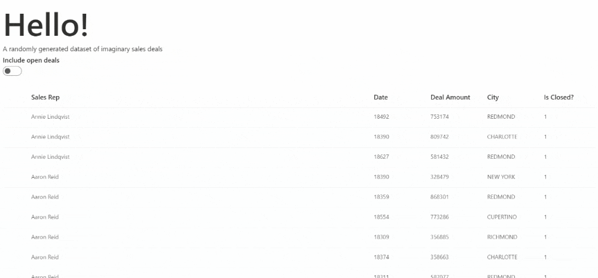
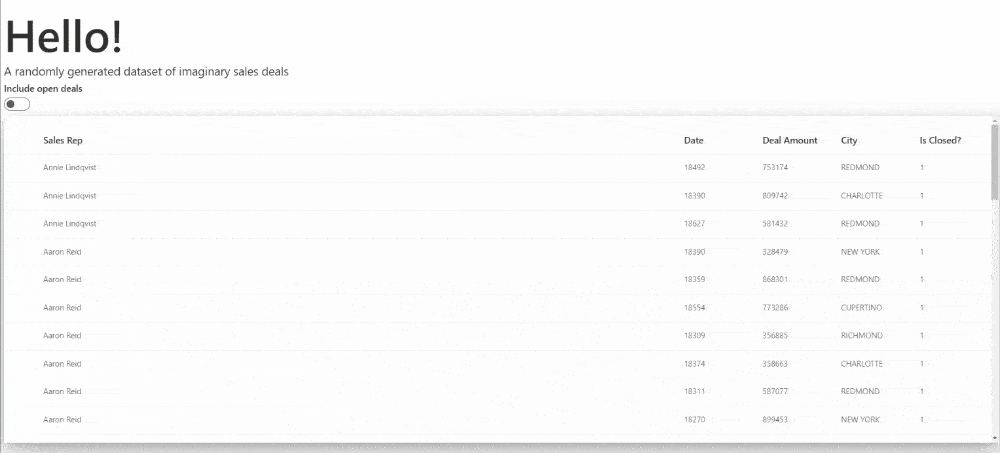

## Hello World with `rhino` and `shiny.fluent`

### Getting started with our development environment

Let us first install and create our `rhino` project structure.

To install `rhino`, please run the following in the R console:

```         
# In R console         
install.packages("rhino")
```

Now, initialize a new rhino application.
You can do it either by using RStudio Wizard or a function `rhino::init()`.

More details on how to create a Rhino app can be found in the [Rhino tutorial](https://appsilon.github.io/rhino/articles/tutorial/create-your-first-rhino-app.html#create-an-initial-application).

You will notice that the working directory now has a proper folder structure along with some other files.

Rhino relies on the [`renv` package](https://rstudio.github.io/renv/index.html) for dependency management.
To add the `shiny.fluent` package to our project, first, we need to install it.

Additionally, we will be also using the `dplyr`, `ggplot2`, `plotly` and `tibble` package for this application.
To save us time in the tutorial we will install them all here.
Please note that for every new package you add, you will need to install them, add them to `dependencies.R`, and run [`renv::snapshot()`](https://rstudio.github.io/renv/reference/snapshot.html) to update the `renv.lock` file.

```         
# In R console
renv::install(c("dplyr", "ggplot2", "plotly", "shiny.fluent", "tibble"))
```

Now that the packages are installed, head over to the `dependencies.R` file and add `shiny.fluent` to it along with the others as shown below.

```
# dependencies.R

# This file allows packrat (used by rsconnect during deployment) to pick up dependencies.
library(dplyr)
library(ggplot2)
library(plotly)
library(rhino)
library(shiny.fluent)
library(tibble)
```

Upon saving the modified file, please take a snapshot of the dependencies so that the `renv.lock` file is updated.

```
# In R console   
renv::snaphot()
```
If you now check the `renv.lock` file, you will see it is updated with the `shiny.fluent` and other packages.

### Our first development on the app

Upon viewing the default `app/main.R` file, you will notice that the code does not have any usage of `shiny.fluent` package to generate the UI. So, let us introduce `shiny.fluent` and use it in our code to generate some text!

```         
# app/main.R

box::use(
  shiny[moduleServer, NS],
  shiny.fluent[fluentPage, Text],
)

#' @export
ui <- function(id) {
  ns <- NS(id)
  fluentPage(      
    Text("Sales Data Dashboard", variant = "xxLarge")
  )
}

#' @export
server <- function(id) {
  moduleServer(id, function(input, output, session) {
    
  })
}
```

The above code uses [`fluentPage`](https://appsilon.github.io/shiny.fluent/reference/fluentPage.html) and [`Text`](https://appsilon.github.io/shiny.fluent/reference/Text.html) from `shiny.fluent` package to render the UI and the sentence - "Sales Data Dashboard".
You will also notice the [`NS(id)`](https://shiny.rstudio.com/reference/shiny/latest/ns) used in the code to return a namespace function, which has been saved as `ns` and will be invoked later in the shiny module.

Now when you run the app, you should be seeing this -

```{r, echo=FALSE}

```

Note: If you check the built-in testcases once changes are introduced, running `rhino::test_r()` will give you errors.
To avoid failed GitHub Actions for now (in case you are pushing your code to GitHub), you may empty the test cases present in `tests/testthat/test-main.R`.

## Show Data in a Table via a `rhino` module

So, in this section, we will introduce a table to our application that displays random imaginary sales deals.
The dataset comes from the `shiny.fluent` package itself - [fluentSalesDeals](https://appsilon.github.io/shiny.fluent/reference/fluentSalesDeals.html).

### Creating the module

In the `app/view/` folder, let us create a new file and name it `datatable.R`

This `app/view/datatable.R` file will be used to display the data table on the UI and we will call this module in the `app/main.R` file once done. Here is the code

```
# app/view/datatable.R

box::use(
  shiny[div, moduleServer, NS, renderUI, uiOutput],
  shiny.fluent[DetailsList, Text],
)

#' @export
ui <- function(id) {
  ns <- NS(id)
    div(
      Text("A randomly generated dataset of imaginary sales deals", variant = "large"),
      uiOutput(ns("datatable"))
    )
}

#' @export
server <- function(id) {
  moduleServer(id, function(input, output, session) {
    output$datatable <- renderUI({
      # Datasets are the only case when you need to use :: in `box`.
      # This issue should be solved in the next `box` release.
      DetailsList(items = shiny.fluent::fluentSalesDeals)
    })
  })
}
```

`fluentSalesDeals` is a dataset available with the `shiny.fluent` package and to use it, we use `::` for directly fetching the dataset from the library. Datasets are the only case when you need to use `::` in `box`.

So, here we are using [`DetailsList`](https://appsilon.github.io/shiny.fluent/reference/DetailsList.html) function in the server side to render the table on the UI.

### Calling the module

Our shiny module `app/view/datatable.R` is ready, but unless we call it in the `app/main.R` file, we won't see any changes on the app. Let us thus go to `app/main.R` file and edit it with the following code -

```         
# app/main.R

box::use(
  shiny[moduleServer, NS],
  shiny.fluent[fluentPage, Text],
)

box::use(
  app/view/datatable,
)

#' @export
ui <- function(id) {
  ns <- NS(id)
  fluentPage(      
    Text("Sales Data Dashboard", variant = "xxLarge"),
    datatable$ui(ns("datatable"))
  )
}

#' @export
server <- function(id) {
  moduleServer(id, function(input, output, session) {
    datatable$server("datatable")
  })
}
```

This code in the `app/main.R` file is based the concept of [Shiny modules](https://shiny.rstudio.com/articles/modules.html) where [box modules in rhino](https://appsilon.github.io/rhino/articles/explanation/box-modules.html) are used.

Notice here that we have called the `datatable` module by importing it to our main application file first.
It is now, that the `main` module will be able to use exported functions from `app/view/datatable.R` module.

Now run the app.
You should be seeing something like this -

```{r, echo=FALSE}

```

### Show informative columns with meaningful names

We will no more display all the columns that come with the dataset. Instead, we will display the `"rep_name", "date", "deal_amount", "city", "is_closed"` columns.

But for that we need to make the names more readable. So, we will assign proper names for every fields using the `tibble` package.

```
columns <- tibble(
  fieldName = c("rep_name", "date", "deal_amount", "city", "is_closed"),
  name = c("Sales Rep", "Date", "Deal Amount", "City", "Is Closed?")
)
```

Also, we need to mention in the `DetailsList()` function to only display the names we just assigned in the `columns` object. Here is how the code gets modified -

```
# app/view/datatable.R

box::use(
  shiny[div, moduleServer, NS, renderUI, uiOutput],
  shiny.fluent[DetailsList, Text],
  tibble[tibble],
)

columns <- tibble(
  fieldName = c("rep_name", "date", "deal_amount", "city", "is_closed"),
  name = c("Sales Rep", "Date", "Deal Amount", "City", "Is Closed?")
)

#' @export
ui <- function(id) {
  ns <- NS(id)
  div(
    Text("A randomly generated dataset of imaginary sales deals", variant = "large"),
    uiOutput(ns("datatable"))
  )
}

#' @export
server <- function(id) {
  moduleServer(id, function(input, output, session) {
    output$datatable <- renderUI({
      DetailsList(items = shiny.fluent::fluentSalesDeals, columns = columns)
    })
  })
}
```

Remember to include `tibble` inside `box::use()`, else the code will not be able to use the package. Upon running the app with all these changes, you should see the improved table -

```{r, echo=FALSE}

```

## Add a simple toggle input feature for the table with basic styling

Till now, we could only view table with all the data it has.
We will now add a functionality to view those rows in the table where value of the "Is Closed?" column is 1 by default and provide a toggle to the user to also include results where the value is 0.
The "Is Closed?" column basically indicates whether the deal is closed or not with values 0 and 1 where 0 means False/No and 1 means True/Yes.

We will make use of the `dplyr` package now. We will use [`Toggle.shinyInput`](https://appsilon.github.io/shiny.fluent/reference/Toggle.html) from `shiny.fluent` package which represents a physical switch that allows someone to choose between two mutually exclusive options. For example,"On/Off","Show/Hide". Choosing an option should produce an immediate result.

In the UI, we include the code for showing the toggle for input - `Toggle.shinyInput(ns("includeOpen"), label = "Include open deals"),` and work on the input provided inside the server section

So, the `app/view/datatable.R` file now is modified to -

```         
# app/view/datatable.R

box::use(
  dplyr[filter],
  shiny[div, moduleServer, NS, reactive, renderUI, uiOutput],
  shiny.fluent[DetailsList, Text, Toggle.shinyInput],
  tibble[tibble],
)

columns <- tibble(
  fieldName = c("rep_name", "date", "deal_amount", "city", "is_closed"),
  name = c("Sales Rep", "Date", "Deal Amount", "City", "Is Closed?")
)

#' @export
ui <- function(id) {
  ns <- NS(id)
  div(
    Text("A randomly generated dataset of imaginary sales deals", variant = "large"),
    div(
      class = "ms-depth-4",
      Toggle.shinyInput(ns("includeOpen"), label = "Include open deals")
    ),
    uiOutput(ns("datatable")),
  )
}

#' @export
server <- function(id) {
  moduleServer(id, function(input, output, session) {
    filtered_deals <- reactive({
      shiny.fluent::fluentSalesDeals |> filter(
        is_closed | input$includeOpen
      )
    })
    output$datatable <- renderUI({
      DetailsList(items = filtered_deals(), columns = columns)
    })
  })
}
```

This code is being used to determine whether open deals (i.e. deals that have not been closed) should be included in the filtered data or not. The `|` symbol between the two conditions is the logical OR operator, which means that the `filter()` function will return all rows where either `is_closed` is TRUE or `input$includeOpen` is TRUE.

Also, please notice that we have added an additional style to the class `ms-depth-4` in the `app/style/main.scss` file. The [`ms-depth-8`](https://developer.microsoft.com/en-us/fluentui#/styles/web/elevation) class is a predefined core class from Microsoft's Fluent UI which provides elevation to the div, `ms-depth-4` being the lowest.

Here is the `app/style/main.scss` file now -

```
// app/style/main.scss

.ms-depth-4 {
    display: flex; 
    flex-wrap: wrap;
    padding: 5px;
}
```
If you try running the application right now, you will not see any changes. That is because rhino uses minified `app/static/app.min.css` for styling. To use it, you will need to build it using the rhino function -

```
# in R console
rhino::build_sass()
```
Please refer to [rhino documentation](https://appsilon.github.io/rhino/articles/tutorial/create-your-first-rhino-app.html#add-custom-styles) for more details on styling.

So, this is how the app looks and works now!

```{r, echo=FALSE}

```

## Improve visuals and layout for the table with elevated cards

We can create cards with elevations just like in Fluent UI [documentation](https://developer.microsoft.com/en-us/fluentui#/styles/web/elevation), as we partially covered it above. For creating cards, we can use [`Stack`](https://appsilon.github.io/shiny.fluent/reference/Stack.html) from `shiny.fluent`.

We will also style the data table area. The following code does the following - 

* Confines the height and width of the table area.
* Creates an elevated card around the data table area.

```
# app/view/datatable.R

box::use(
  dplyr[filter],
  shiny[div, moduleServer, NS, reactive, renderUI, span, uiOutput],
  shiny.fluent[DetailsList, Stack, Text, Toggle.shinyInput],
  tibble[tibble],
)

columns <- tibble(
  fieldName = c("rep_name", "date", "deal_amount", "city", "is_closed"),
  name = c("Sales Rep", "Date", "Deal Amount", "City", "Is Closed?")
)

#' @export
ui <- function(id) {
  ns <- NS(id)
  div(
    Text("A randomly generated dataset of imaginary sales deals", variant = "large"),
    div(
      class = "ms-depth-4",
      Toggle.shinyInput(ns("includeOpen"), label = "Include open deals")
    ),
    Stack(
      horizontal = TRUE,
      tokens = list(padding = 20, childrenGap = 10),
      span(class = "ms-depth-8", uiOutput(ns("datatable")))
    )
  )
}

#' @export
server <- function(id) {
  moduleServer(id, function(input, output, session) {
    filtered_deals <- reactive({
      shiny.fluent::fluentSalesDeals |> filter(
        is_closed | input$includeOpen
      )
    })
    output$datatable <- renderUI({
      DetailsList(items = filtered_deals(), columns = columns)
    })
  })
}
```
The `Stack` element in the code allows for stacking multiple elements vertically or horizontally.

The horizontal argument is set to TRUE to horizontally stack the two elements. The tokens argument is a list that specifies the padding and the gap between the two elements. In this case, the padding is set to 20 and the childrenGap is set to 10. This will add a padding of 20 pixels and a gap of 10 pixels between the other `span` of the `Stack` element.

The span element has a class attribute set to `ms-depth-8`. This is a class provided by the Microsoft fluent UI that adds a shadow effect to the element, giving it a depth effect. The `uiOutput` element is used to render the `DetailsList` element that contains the filtered data.

The additional style for the class `ms-depth-8` is added in the `app/style/main.scss` file. So it now is modified to -
```
// app/style/main.scss

.ms-depth-4 {
    display: flex; 
    flex-wrap: wrap;
    padding: 5px;
}

.ms-depth-8 {
    height: 500px; 
    overflow: overlay; 
    width: 50%; 
    display: inline-block;
}
```

The Sass code limits the height of the table to 500 pixels, width to 50% of the screen size and allows scrolling through the data. Similar to the previous usecase, we would again have to repeat the Sass building process with `rhino` as the file has been updated.

```
# in R console
rhino::build_sass()
```

So, this is how the UI should look now -

```{r, echo=FALSE}

```
Note that we now we have space beside the table for additional UI component(s).

## Create separate `rhino` modules for toggle input and datatable

Now that we have successfully introduced a datatable and a toggle input in our application, let us further create different Rhino modules for them!

We already have the datatable module with us. We will thus create one more module - `app/view/toggle.R` and make some modifications in `app/view/datatable`. 

These modules will be called from the main file.

### The `app/view/toggle.R` module -

```
# app/view/toggle.R

box::use(
  dplyr[filter],
  shiny[div, moduleServer, NS, reactive],
  shiny.fluent[Text, Toggle.shinyInput],
)

#' @export
ui <- function(id) {
  ns <- NS(id)
  div(
    class = "ms-depth-4",
    Toggle.shinyInput(ns("includeOpen"), label = "Include open deals")
  )
}

#' @export
server <- function(id) {
  moduleServer(id, function(input, output, session) {
    filtered_deals <- reactive({
      shiny.fluent::fluentSalesDeals |> filter(
        is_closed | input$includeOpen
      )
    })
    return(filtered_deals)      
  }) 
}
```
This module displays a toggle input item on the UI which the user can interact with. The styling remains the same as we discussed in the previous sections.

As the user interacts with the toggle input, the data is filtered in the server. This filtered data is returned to the main module.

### The modified `app/view/datatable.R` module

As the `toggle` module returns the filtered data, it is used in the `datatable` module so that the data is displayed on a table accordingly. Hence, our `datatable` module is modified as shown below -

```
# app/view/datatable.R

box::use(
  shiny[moduleServer, NS, reactive, renderUI, uiOutput],
  shiny.fluent[DetailsList],
  tibble[tibble],
)

columns <- tibble(
  fieldName = c("rep_name", "date", "deal_amount", "city", "is_closed"),
  name = c("Sales Rep", "Date", "Deal Amount", "City", "Is Closed?")
)

#' @export
ui <- function(id) {
  ns <- NS(id)
  uiOutput(ns("datatable"))
}

#' @export
server <- function(id, data) {
  moduleServer(id, function(input, output, session) {
    output$datatable <- renderUI({
      DetailsList(items = data(), columns = columns)
    })
  })
}
```
Please notice, that inside the server function, the response obtained from the `toggle` module earlier is also passed on to be used in displaying the data in a table. 

We are not returning any information from this module to the main module as it's sole purpose is to display given data in a table with desired columns in an easily readable form.

### The modified `app/main.R` module

Since we modified the modules, `app/main.R` also has to be modified.

```
# app/main.R

box::use(
  shiny[moduleServer, NS, span],
  shiny.fluent[fluentPage, Stack, Text],
)

box::use(
  app/view/datatable,
  app/view/toggle,
)

#' @export
ui <- function(id) {
  ns <- NS(id)
  fluentPage(      
    Text("Sales Data Dashboard", variant = "xxLarge"),
    Text("A randomly generated dataset of imaginary sales deals", variant = "large"),
    toggle$ui(ns("toggle")),
    Stack(
      horizontal = TRUE,
      tokens = list(padding = 20, childrenGap = 10),
      span(class = "ms-depth-8", datatable$ui(ns("datatable")))
    )
  )
}

#' @export
server <- function(id) {
  moduleServer(id, function(input, output, session) {
    data <-toggle$server("toggle")
    datatable$server("datatable", data)
  })
}
```
Here we have used the `toggle` and `datatable` modules and called them from the code.

## Create a `rhino` module to render a bar chart with logic in a helper function

We will now add a bar chart that plots the summarized amount of deals closed by the sales reps. For this, we will code a helper function and keep it inside the `app/logic` folder.

### Define the helper function

Go to the `app/logic` folder and create a new `.R` file. Lets name it `barchart.R`. We shall use the `gglplot2` and `plotly` packages now (which we installed in the beginning) for this purpose. 

Here is the code -

```
# app/logic/barchart.R

box::use(
  ggplot2[aes, element_text, geom_bar, ggplot, labs, theme, theme_light],
)

#' @export
generate_barchart <- function(filtered_data) {
  ggplot(filtered_data, aes(x = rep_name, y = deal_amount, fill = rep_name)) +
    geom_bar(stat = "identity") +
    labs(x = "Sales Rep Name", y = "Deal Amount") +
    theme_light() +
    theme(axis.text.x = element_text(angle = 60, hjust = 1))
}
```

The above code block loads the `ggplot2` package and generates a barchart with the names of the sales reps on the X axis and the summarized amount of deals on the Y axis.

### Create a new `rhino` module and call the helper function

Now let us create a new file in `app/view` folder and name it `plot.R`. 

This module, like the `app/view/datatable.R` module, also obtains the data returned from the `toggle` module and renders a barchart using the `app/logic/barchart.R` logic.

```
# app/view/plot.R

box::use(
  plotly[plotlyOutput, renderPlotly],
  shiny[moduleServer, NS],
)

box::use(
  app/logic/barchart[generate_barchart],
)

#' @export
ui <- function(id) {
  ns <- NS(id)
  plotlyOutput(ns("barchart"))
}

#' @export
server <- function(id, data) {
  moduleServer(id, function(input, output, session) {
    output$barchart <- renderPlotly({
      generate_barchart(data())
    })
  })
}
```

Here, we have called the `plotly` library, and also the function that we defined in the `app/logic` folder. `plotlyOutput` will help us to render the graph.

### Modify the `app/main.R` module

To view the barchart on the application, we need to use and call it from the main module. 

```
# app/main.R
box::use(
  shiny[moduleServer, NS, span],
  shiny.fluent[fluentPage, Stack, Text],
)

box::use(
  app/view/datatable,
  app/view/toggle,
  app/view/plot,
)

#' @export
ui <- function(id) {
  ns <- NS(id)
  fluentPage(      
    Text("Sales Data Dashboard", variant = "xxLarge"),
    Text("A randomly generated dataset of imaginary sales deals", variant = "large"),
    toggle$ui(ns("toggle")),
    Stack(
      horizontal = TRUE,
      tokens = list(padding = 20, childrenGap = 10),
      span(class = "ms-depth-8", datatable$ui(ns("datatable"))),
      span(class = "ms-depth-8", plot$ui(ns("plot")))
    )
  )
}

#' @export
server <- function(id) {
  moduleServer(id, function(input, output, session) {
    data <-toggle$server("toggle")
    datatable$server("datatable", data)
    plot$server("plot", data)
  })
}
```
The code now uses all the other modules that we just created/modified, creates the cards in the UI using `Stack` in a `fluentPage` from the `shiny.fluent` package, calls the modules accordingly and passes on the relevant information to each other in the server to have a working web application.

Once ready, on running the application, we should see the plotly bar chart rendering successfully and also responding to our interactions with the toggle input button.

```{r, echo=FALSE}
knitr::include_graphics("images/rhino_fluent_gif_3.gif")
```
## Next Steps and Suggested Readings

By now, we have explored `rhino` and `shiny.fluent` packages to an extent, but this is just the beginning.
It is strongly recommended for the reader to further explore these packages and build great RShiny applications.
Congratulations on coming this far and all the best for the road that lies ahead!

Following are some resources which could be considered for further exploration -

* [All about rhino](https://appsilon.com/rhino-r-package-tutorial/)
* [Reference for all Shiny.fluent functions](https://appsilon.github.io/shiny.fluent/reference/index.html)
* [How to use shiny.fluent with Shiny modules](https://appsilon.github.io/shiny.fluent/articles/sz-how-to-shiny-modules.html)
* [Tutorial: Create your first shiny.fluent dashboard](https://appsilon.github.io/shiny.fluent/articles/shiny-fluent.html)
* [Tutorial: Full dashboard UI in Shiny and Fluent](https://appsilon.github.io/shiny.fluent/articles/st-sales-reps-dashboard.html)
