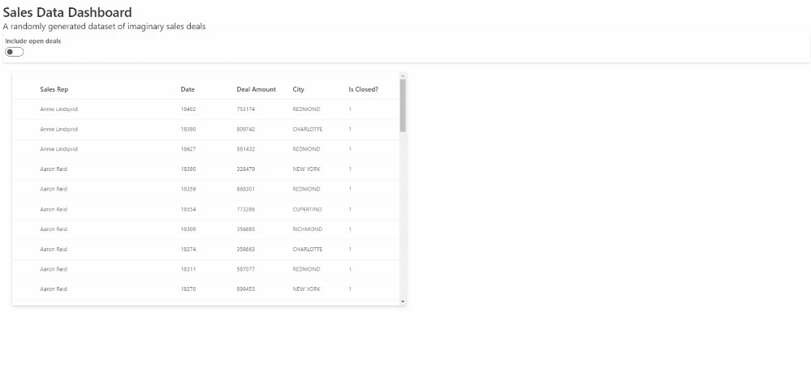

## Hello World with `rhino` and `shiny.fluent`

### Getting started with our development environment

Let us first install and create our `rhino` project structure.

To install `rhino`, please run the following on a R console in your working directory

```         
install.packages("rhino")
```

Now, initialize a new Rhino application.
You can do it either by using RStudio Wizard or a function `rhino::init()`.

More details on how to create a Rhino app can be found in the [Rhino tutorial](https://appsilon.github.io/rhino/articles/tutorial/create-your-first-rhino-app.html#create-an-initial-application).

You will notice that the working directory now has a proper folder structure along with some other files.
Among those, you will also notice that `renv` is being used to manage the packages/dependencies for the project.
So, let us now install `shiny.fluent` into the project.

```         
renv::install("shiny.fleunt")
```

Using renv for installation benefits us.
In particular, this means that the local cache of package installations is used when possible.
This helps to avoid re-downloading packages that have already been downloaded before, and re-compiling packages from source when a binary copy of that package is already available.

Now, head over to the `dependencies.R` file and add `shiny.fluent` to it as shown below.

```         
library(rhino)
library(shiny.fluent)
```

Upon saving the modified file, please take a snapshot of the dependencies so that the `renv.lock` file is updated.

```         
renv::snaphot()
```

Maintain this process whenever we need to install a new package in the project henceforth.

Note: It is always a good practice to install all required packages at the beginning of your project.
However, for the sake of this tutorial, we introduce you to a new package when the need arises.
For a routine usecase and/or practice, please install all required packages at the beginning.

### Our first development on the app

-   Open the `app/main.R` file.
    By default, it has the following code -

    ```         
    box::use(
      shiny[bootstrapPage, moduleServer, NS, renderText, tags, textOutput],
    )

    #' @export
    ui <- function(id) {
      ns <- NS(id)
      bootstrapPage(
        tags$h3(
          textOutput(ns("message"))
        )
      )
    }

    #' @export
    server <- function(id) {
      moduleServer(id, function(input, output, session) {
        output$message <- renderText("Hello!")
      })
    }
    ```

-   You will notice that currently the `main.R` file's code does not have any usage of `shiny.fluent` package to generate the text - "Hello!".
    So let us introduce `shiny.fluent` and use it in our code to do the same action!

```         
box::use(
  shiny[moduleServer, NS],
  shiny.fluent[fluentPage, Text]
)

#' @export
ui <- function(id) {
  ns <- NS(id)
  fluentPage(
    Text("Hello!", variant = "mega")
  )
}

#' @export
server <- function(id) {
  moduleServer(id, function(input, output, session) {
  
  })
}
```

The above code uses [`fluentPage`](https://appsilon.github.io/shiny.fluent/reference/fluentPage.html) and [`Text`](https://appsilon.github.io/shiny.fluent/reference/Text.html) from `shiny.fluent` package to render the UI and text.
You will also notice the [`NS(id)`](https://shiny.rstudio.com/reference/shiny/latest/ns) used in the code to return a namespace function, which has been saved as `ns` and will be invoked later in the shiny module.

Now when you run the app, you should be seeing this -

```{r, echo=FALSE}
knitr::include_graphics("images/rhino_fluent_1.png")
```

Note: If you check the built-in testcases once changes are introduced, running `rhino::test_r()` will give you errors.
To avoid failed github actions for now (in case you are pushing your code to Github), you may empty the test cases present in `tests/testthat/test-main.R`.

## Show Data in a Table via a `rhino` module

So, in this section, we will introduce a table to our application that displays random imaginary sales deals.
The dataset comes from the `shiny.fluent` package itself - [fluentSalesDeals](https://appsilon.github.io/shiny.fluent/reference/fluentSalesDeals.html).

### Creating the module

-   In the `app/view/` folder, let us create a new file and name it `datatable.R`

-   This `app/view/datatable.R` file will be used to display the data table on the UI and we will call this module in the `app/main.R` file once done.
    Here is the code

    ```         
    #app/view/datatable.R

    box::use(
      shiny[moduleServer, NS],
      shiny.fluent[fluentPage, Text, DetailsList]
    )

    #' @export
    ui <- function(id) {
      ns <- NS(id)
        fluentPage(
            Text("A randomly generated dataset of imaginary sales deals"),
            DetailsList(items = shiny.fluent::fluentSalesDeals)
        )
    }

    #' @export
    server <- function(id) {
      moduleServer(id, function(input, output, session) {

      })
    }
    ```

`fluentSalesDeals` is a dataset available with the `shiny.fluent` package and to use it, we use `::` for directly fetching the dataset from the library.

So, here we are using [`DetailsList`](https://appsilon.github.io/shiny.fluent/reference/DetailsList.html) function to render the table.

### Calling the module

-   Go to `app/main.R` file and edit it with the following code

```         
#app/main.R

box::use(
  shiny[moduleServer, NS],
  shiny.fluent[fluentPage, Text]
)

box::use(
  app/view/datatable,
)

#' @export
ui <- function(id) {
  ns <- NS(id)
  fluentPage(
    Text("Hello!", variant = "mega"),
    datatable$ui(ns("datatable"))
  )
}

#' @export
server <- function(id) {
  moduleServer(id, function(input, output, session) {
    datatable$server("datatable")
  }
  )
}
```

Notice here that we have called the `datatable` module by importing it to our main application file first.
It is now, that the main module will be able to use exported functions from `app/view/datatable.R`.

This code in the `app/main.R` file is based the concept of [Shiny modules](https://shiny.rstudio.com/articles/modules.html) where [box modules in Rhino](https://appsilon.github.io/rhino/articles/explanation/box-modules.html) are used.

In the **`ui`** function, **`ns`** is used to create a unique namespace for the **`datatable`** element using the **`ns("datatable")`** syntax.
This is important because when the UI contains multiple instances of the same element (e.g. multiple tables), each instance must have a unique namespace to prevent naming conflicts in the server function.

In the **`server`** function, the **`ns`** function is not used directly, but its generated namespace is used as an argument for the **`datatable$server()`** function call.
This allows the server to reference the specific instance of the **`datatable`** element that is associated with the current session.

Now run the app.
You should be seeing something like this -

```{r, echo=FALSE}
knitr::include_graphics("images/rhino_fluent_2.png")
```

### Some improvements

#### Show informative columns with meaningful names

-   We will no more display all the columns that come with the dataset.
    Instead, we will display the `"rep_name", "date", "deal_amount", "city", "is_closed"` columns.

-   But for that we need to make the names more readable.
    So, we will assign proper names for every fields using the `tibble` package -

    ```         
    columns <- tibble(
        fieldName = c("rep_name", "date", "deal_amount", "city", "is_closed"),
        name = c("Sales Rep", "Date", "Deal Amount", "City", "Is Closed?")
        )
    ```

-   Also, we need to mention in the `DetailsList()` function inside UI to only display the names we just assigned in the `columns` object.
    Here is how the `ui` function now gets modified -

    ``` r
    #app/view/databale.R

    box::use(
      shiny[moduleServer, NS, uiOutput, renderUI],
      shiny.fluent[fluentPage, Text, DetailsList],
      tibble[tibble]
    )

    #' @export
    ui <- function(id) {
      ns <- NS(id)
        fluentPage(
            Text("A randomly generated dataset of imaginary sales deals"),
            DetailsList(items = shiny.fluent::fluentSalesDeals, columns = columns)
        )
    }

    #' @export
    server <- function(id) {
      moduleServer(id, function(input, output, session) {

      })
    }
    ```

    Remember to include `tibble` inside `box::use()`, else the code will not be able to use the package.

-   Upon running the app with all these changes, you should see the improved table -

```{r, echo=FALSE}
knitr::include_graphics("images/rhino_fluent_3.png")
```

#### Render the Table from the server side inside the `datatable` module

-   Till now, we did not do anything inside the server side of the `app/view/datatable.R` file.
    Let us now use the server side to render the table rather than the UI side.
    This is particularly helpful when we want to introduce more features inside the table - such as user inputs.

-   So, here is the new modified `app/view/databale.R` file

    ```         
    #app/view/databale.R

    box::use(
      shiny[moduleServer, NS, uiOutput, renderUI],
      shiny.fluent[fluentPage, Text, DetailsList],
      tibble[tibble]
    )

    columns <- tibble(
        fieldName = c("rep_name", "date", "deal_amount", "city", "is_closed"),
        name = c("Sales Rep", "Date", "Deal Amount", "City", "Is Closed?")
        )

    #' @export
    ui <- function(id) {
      ns <- NS(id)
        fluentPage(
            Text("A randomly generated dataset of imaginary sales deals"),
            uiOutput(ns("datatable"))
            )
    }

    #' @export
    server <- function(id) {
      moduleServer(id, function(input, output, session) {
        output$datatable <- renderUI({
            DetailsList(items = shiny.fluent::fluentSalesDeals, columns = columns)
        })
      })
    }
    ```

The **`DetailsList`** table is being rendered inside the **`renderUI`** function, which generates UI output dynamically based on the **`items`** and **`columns`** arguments.
The **`renderUI`** function is triggered whenever there is a change in the input values or reactive expressions that depend on them (we will explore this further).

The **`columns`** data frame defines the field names and column names for the **`DetailsList`**.
The **`fieldName`** column contains the names of the columns in the **`shiny.fluent::fluentSalesDeals`** data frame, and the **`name`** column contains the display names for those columns.

## Add a simple toggle input feature for the table

Till now, we could only view table with all the data it has.
We will now add a functionality to view those rows in the table where value of the "Is Closed?" column is 1 by default and provide a toggle to the user to also include results where the value is 0.
The "Is Closed?" column basically indicates whether the deal is closed or not with values 0 and 1 where 0 means False/No and 1 means True/Yes.

-   Let us first install the `dplyr` package.
    Please follow the same process we followed for `shiny.fluent` installation.

-   We will use [`Toggle.shinyInput`](https://appsilon.github.io/shiny.fluent/reference/Toggle.html) from `shiny.fluent` package which represents a physical switch that allows someone to choose between two mutually exclusive options.For example,"On/Off","Show/Hide".Choosing an option should produce an immediate result.

-   In the UI, we include the code for showing the toggle for input - `Toggle.shinyInput(ns("includeOpen"), label = "Include open deals"),` and work on the input provided inside the server section

So, the `app/view/datatable.R` file now is modified to -

```         
# app/view/datatable.R

box::use(
  dplyr[filter]
  shiny[moduleServer, NS, uiOutput, renderUI, reactive],
  shiny.fluent[fluentPage, Text, DetailsList, Toggle.shinyInput],
  tibble[tibble]
)

columns <- tibble(
    fieldName = c("rep_name", "date", "deal_amount", "city", "is_closed"),
    name = c("Sales Rep", "Date", "Deal Amount", "City", "Is Closed?")
    )

#' @export
ui <- function(id) {
  ns <- NS(id)
    fluentPage(
        Text("A randomly generated dataset of imaginary sales deals"),
        Toggle.shinyInput(ns("includeOpen"), label = "Include open deals"),
        uiOutput(ns("datatable"))
        )
}

#' @export
server <- function(id) {
  moduleServer(id, function(input, output, session) {
    
    filtered_deals <- reactive({
      shiny.fluent::fluentSalesDeals |> filter(
        is_closed | input$includeOpen
      )
    })

    output$datatable <- renderUI({
        DetailsList(items = filtered_deals(), columns = columns)
    })
  })
}
```

This code is defining a reactive expression called **`filtered_deals`** in an R Shiny application.

The reactive expression uses the **`|>`** operator to pipe the **`shiny.fluent::fluentSalesDeals`** data frame to the **`filter()`** function which comes from the `dplyr` package.
The **`filter()`** function is used to filter rows from a data frame based on one or more conditions.

In this case, the **`filter()`** function is filtering rows from **`shiny.fluent::fluentSalesDeals`** based on two conditions:

-   **`is_closed`**: This is a logical column in the **`shiny.fluent::fluentSalesDeals`** data frame that indicates whether a sales deal has been closed or not.

-   **`input$includeOpen`**: This is a reactive input object that is defined in the UI part of the code.
    It is used to determine whether open deals (i.e. deals that have not been closed) should be included in the filtered data or not.

The **`|`** symbol between the two conditions is the logical OR operator, which means that the **`filter()`** function will return all rows where either **`is_closed`** is TRUE or **`input$includeOpen`** is TRUE.

This is how the app looks now!

```{r, echo=FALSE}

```

## Improve visuals for the table with elevated cards

We can create cards with elevations just like in Fluent UI [documentation](https://developer.microsoft.com/en-us/fluentui#/styles/web/elevation).
Let us style the data table area.

The following code does 2 things -

-   Creates an elevated card around the data table area

-   Confines the height of the table area

```         
# app/view/datatable.R

box::use(
  dplyr[filter]
  shiny[moduleServer, NS, uiOutput, renderUI, reactive],
  shiny.fluent[fluentPage, Text, DetailsList, Toggle.shinyInput],
  tibble[tibble]
)

columns <- tibble(
    fieldName = c("rep_name", "date", "deal_amount", "city", "is_closed"),
    name = c("Sales Rep", "Date", "Deal Amount", "City", "Is Closed?")
    )

#' @export
ui <- function(id) {
  ns <- NS(id)
    fluentPage(
        Text("A randomly generated dataset of imaginary sales deals"),
        Toggle.shinyInput(ns("includeOpen"), label = "Include open deals"),
        div(
          class = "ms-depth-64", 
          style = "height: 500px; overflow: auto;",
          uiOutput(ns("datatable"))
        ))
}

#' @export
server <- function(id) {
  moduleServer(id, function(input, output, session) {
    
    filtered_deals <- reactive({
      shiny.fluent::fluentSalesDeals |> filter(
        is_closed | input$includeOpen
      )
    })

    output$datatable <- renderUI({
        DetailsList(items = filtered_deals(), columns = columns)
    })
  })
}
```

The above code creates a **`div`** element with the following attributes -

**`class = "ms-depth-64"`**assigns the CSS class **`ms-depth-64`** to the **`div`** element, which may define the element's visual appearance and behavior.

**`style = "height: 500px; overflow: auto;"`** sets the inline CSS style for the **`div`** element.
Specifically, it sets the height of the **`div`** element to be 500 pixels and enables scrolling within the **`div`** element when its contents overflow its boundaries.

So, this is how the UI should look now -

```{r, echo=FALSE}

```

Note: Inline styling is a bad practice!
For styling, use Sass setup provided by Rhino.
Please refer to this [rhino documentation](https://appsilon.github.io/rhino/articles/tutorial/create-your-first-rhino-app.html#add-custom-styles) for details.

## Render a Bar Chart with logic in a helper function

We will now add a bar chart that plots the deal amounts closed by the sales reps. For this, we will code a helper function and keep it inside the `app/logic` folder.

### Helper function in the logic folder of the `rhino` project

-   Go to the `app/logic` folder and create a new `.R` file.
    Lets name it `barchart.R`

-   Install `gglplot2` and `plotly` packages for this purpose.
    Please follow the same steps that were followed previously during and after new package installation.

-   Here is the code -

    ```         
    box::use(
      ggplot2[ggplot, aes, geom_bar, labs, theme_light],
    )

    #' @export
    generate_barchart <- function(filtered_data) {
      ggplot(filtered_data, aes(x = rep_name, y = deal_amount, fill = rep_name)) +
        geom_bar(stat = "identity") +
        labs(x = "Sales Rep Name", y = "Deal Amount") +
        theme_light()
    }
    ```

-   The above code block loads the **`ggplot2`** package and imports several functions from it.
    It then defines a function called **`generate_barchart()`** that takes a **`filtered_data`** argument as input.
    The function uses the **`ggplot()`** function to create a bar chart with **`x = rep_name`** and **`y = deal_amount`**, where **`rep_name`** and **`deal_amount`** are columns in the **`filtered_data`** data frame.
    The **`fill`** aesthetic is also set to **`rep_name`**, which maps each bar to a unique color based on the **`rep_name`** variable.
    The function also adds labels to the x and y axes and applies the **`theme_light()`** theme to the plot.
    Finally, the function is exported with **`#' @export`**, which makes it available to other packages and scripts that import this one.

### Call the helper function in the desired `rhino` module

-   Now let us go back to the `app/view/datatable.R` file.
    Here we need to call the `generate_barchart()` function we just created along with the required dependencies to render it on UI as a plotly bar chart.

-   So, the code begins with

    ```         
    box::use(
      dplyr[filter],
      plotly[plotlyOutput, renderPlotly],
      shiny[moduleServer, NS, uiOutput, renderUI, reactive, div],
      shiny.fluent[fluentPage, Text, DetailsList, Toggle.shinyInput],
      tibble[tibble]
    )

    box::use(
      app/logic/barchart[generate_barchart],
    )
    ```

Here, we have called the `plotly` library, and also the function that we defined in the `app/logic` folder.

-   Now, we will add one more `div` in the ui section after the datatable to make room for the bar chart

```         
  div(
      class = "ms-depth-64",
      style = "height: 500px; overflow: auto;",
      plotlyOutput(ns("barchart"))
      )
      
```

`plotlyOutput` will help us to render the graph

Note: Inline styling is a bad practice!
For styling, use Sass setup provided by Rhino.
Please refer to this [rhino documentation](https://appsilon.github.io/rhino/articles/tutorial/create-your-first-rhino-app.html#add-custom-styles) for details.

-   Similarly, in the server section, we will need to add some code to ask the backend of the application for rendering the barchart

    ```         
     output$barchart <- renderPlotly({
            generate_barchart(filtered_deals())
        })
    ```

Here is the whole snippet

```         
# app/view/datatable.R

box::use(
  dplyr[filter],
  plotly[plotlyOutput, renderPlotly],
  shiny[moduleServer, NS, uiOutput, renderUI, reactive, div],
  shiny.fluent[fluentPage, Text, DetailsList, Toggle.shinyInput],
  tibble[tibble]
)

box::use(
  app/logic/barchart[generate_barchart],
)

columns <- tibble(
  fieldName = c("rep_name", "date", "deal_amount", "city", "is_closed"),
  name = c("Sales Rep", "Date", "Deal Amount", "City", "Is Closed?")
  )

#' @export
ui <- function(id) {
  ns <- NS(id)
  fluentPage(
    Text("A randomly generated dataset of imaginary sales deals"),
    Toggle.shinyInput(ns("includeOpen"), label = "Include open deals"),
    div(
      class = "ms-depth-64", 
      style = "height: 500px; overflow: auto;",
      uiOutput(ns("datatable"))
    ),
    div(
      class = "ms-depth-64",
      style = "height: 500px; overflow: auto;",
      plotlyOutput(ns("barchart"))
    ))
}

#' @export
server <- function(id) {
  moduleServer(id, function(input, output, session) {
    
    filtered_deals <- reactive({
      shiny.fluent::fluentSalesDeals |> filter(
        is_closed | input$includeOpen
      )
    })
    
    output$datatable <- renderUI({
      DetailsList(items = filtered_deals(), columns = columns)
    })
    
    output$barchart <- renderPlotly({
      generate_barchart(filtered_deals())
    })
  })
}
```

Once ready, on running the application, we should see the plotly bar chart rendering successfully and also responding to our interactions with the toggle input button.

```{r, echo=FALSE}
knitr::include_graphics("images/rhino_fluent_4.png")
```

## Some Improvements for better User Experience

### Keep the data table and bar chart on the same row

This can be done by wrapping the `div`s into a parent `div` and using the **`container-fluid`** class to ensure that the **`div`**s fill the screen horizontally.

```         
div(
  class = "container-fluid",
  style = "margin-left: 0px; margin-right: 0px;",
  div(
    class = "ms-depth-8",
    style = "height: 500px; overflow: auto; width: 50%; display: inline-block;",
    uiOutput(ns("datatable"))
  ),
  div(
    class = "ms-depth-8",
    style = "height: 500px; overflow: auto; width: 50%; display: inline-block;",
    plotlyOutput(ns("barchart"))
  ),
  style = "display: flex; flex-wrap: wrap;"
)
```

We also set the **`margin-left`** and **`margin-right`** to 0 pixels to remove any horizontal margin that might exist.
To make the **`div`**s display side by side, we set the **`display`** property to **`inline-block`**.
We also set the width of each **`div`** to **`50%`** to ensure that they fill half the screen each.

### Change orientation of X axis labels in plotly bar chart

```         
#' @export
generate_barchart <- function(filtered_data) {
  ggplot(filtered_data, aes(x = rep_name, y = deal_amount, fill = rep_name)) +
    geom_bar(stat = "identity") +
    labs(x = "Sales Rep Name", y = "Deal Amount") +
    theme_light()+
    theme(axis.text.x = element_text(angle = 60, hjust = 1))
}
```

We just need to add the **`theme(axis.text.x = element_text(angle = 90, hjust = 1))`** line to the **`ggplot`** call.
This modifies the **`axis.text.x`** element of the plot's theme, which controls the appearance of the X axis labels.

The **`element_text()`** function takes several arguments to customize the text appearance, including the **`angle`** argument to specify the rotation angle in degrees.
Here, we set the angle to 60 degrees to rotate the labels slightly vertically, and we set the **`hjust`** argument to 1 to align the labels to the right of the tick marks.

### Change the application header

We will no longer keep it as "Hello!".
Instead, just like we did in the datatable module, we will put a new text into a card and add some styling.
Here is the change we used for the tutorial -

```         
#' @export
ui <- function(id) {
  ns <- NS(id)
  fluentPage(
    div(
      class = "ms-depth-8",
      style = "padding: 5px;",
      Text("Sales Data Dashboard", variant = "xxLarge")
    ),
    datatable$ui(ns("datatable"))
  )
}
```

```{r, echo=FALSE}
knitr::include_graphics("images/rhino_fluent_5.png")
```

```{r, echo=FALSE}
knitr::include_graphics("images/rhino_fluent_6.png")
```

### Use `Sass` setup provided by `rhino` instead of inline CSS

This tutorial uses inline CSS in some places from a proof of concept perspective.
Inline CSS is not a good coding practice, especially when it comes to projects on production!
We highly recommend using the `Sass` setup that is available in the `rhino` project structure.

Please refer to this [resource](https://appsilon.github.io/rhino/articles/tutorial/create-your-first-rhino-app.html) to get started with the same.

## Next Steps and Further Suggested Readings

By now, we have explored `rhino` and `shiny.fluent` packages to an extent, but this is just the beginning.
It is strongly recommended for the reader to further explore these packages and build great RShiny applications.
Congratulations on coming this far and all the best for the road that lies ahead!

Following are some resources which could be considered for further exploration -

-   [All about Rhino](https://appsilon.com/rhino-r-package-tutorial/)

-   [Reference for all Shiny.fluent functions](https://appsilon.github.io/shiny.fluent/reference/index.html)

-   [How to use shiny.fluent with Shiny modules](https://appsilon.github.io/shiny.fluent/articles/sz-how-to-shiny-modules.html)

-   [Tutorial: Create your first shiny.fluent dashboard](https://appsilon.github.io/shiny.fluent/articles/shiny-fluent.html)

-   [Tutorial: Full dashboard UI in Shiny and Fluent](https://appsilon.github.io/shiny.fluent/articles/st-sales-reps-dashboard.html)
