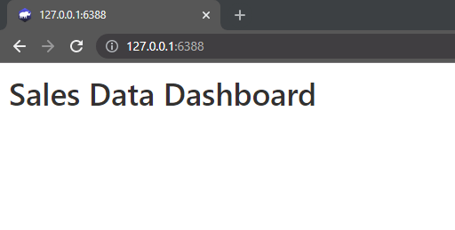

## Let's install `rhino` first

We assume that you do not have `rhino` pre-installed.
In that case, here's how you can install the package 👇

``` r
install.packages("rhino")
```

💡To use the state of the art JavaScript and Sass development tools provided by Rhino, you'll need to [install Node.js](https://nodejs.org/en/download/) (v12 or later) on your system.
Rhino will still work without Node.js but with some limitations (described in [JavaScript](https://appsilon.github.io/rhino/articles/tutorial/create-your-first-rhino-app.html#add-javascript-code) and [Sass](https://appsilon.github.io/rhino/articles/tutorial/create-your-first-rhino-app.html#add-custom-styles) sections of our docs).

## Create an initial `rhino` application

Now that you have the package installed, let's use `rhino` to create an initial application for us which we can use for the next steps of our project.

Creating a new Rhino application can be done in two ways - by using the **Create Project** functionality on RStudio IDE or by running **`rhino::init()`** function from the console.
We'll discuss more about this below 👇

### 👉 Create an application using the RStudio wizard

If you use RStudio, probably the easiest way to create a new Rhino application is to simply use Create `New Project` feature.
Once Rhino is installed, it will be automatically added as one of the options in RStudio:

Choose it, input the new project name and you are ready to go 👍


### 👉 Create an application using `rhino::init()`

Creating a Rhino application is possible in the R console by running the `init` function:

``` r
rhino::init("RhinoApplication")
```

There are two things you need to know when choosing this way of initializing your application:

-   **Rhino will not change your working directory** - You need to either open a new R session in your new application directory or manually change the working directory.

```         
setwd("./RhinoApplication")
```

-   **Rhino relies on options added to the projects `.Rprofile` file -** The most robust way to make sure it was correctly sourced is to simply restart the R session.

A result of both paths will be an initial Rhino application with the following structure:

```         
.
├── RhinoApplication.Rproj
├── app
│ ├── js
│ │ └── index.js
│ ├── logic
│ │ └── __init__.R
│ ├── main.R
│ ├── static
│ │ └── favicon.ico
│ ├── styles
│ │ └── main.scss
│ └── view
│     └── __init__.R
├── app.R
├── config.yml
├── dependencies.R
├── renv.lock
├── rhino.yml
└── tests
    ├── cypress
    │ └── integration
    │     └── app.spec.js
    ├── cypress.json
    └── testthat
        └── test-main.R
```

If you want to know more about it, check [this](https://appsilon.github.io/rhino/articles/explanation/application-structure.html) document.

### 🚀 Running the initial application

Now, once you are all set up, let's run it:

```         
shiny::runApp()
```

And here is what you should be seeing right now 👇

{width="620" height="268"}

## Let's install `shiny.fluent` for our project

💡The rhino project you just started uses `renv` for dependency management.
You can now install any other package in the same project and include it in the `renv.lock` file.

Here's how you can install the `shiny.fluent` package 👇

``` r
install.packages("shiny.fluent")
```

Now that the package is installed, let us use it for building our very first `rhino` module.

## `Rhino` module with `shiny.fluent`

In Rhino, each application view is intended to live as a [Shiny module](https://shiny.rstudio.com/articles/modules.html) and use encapsulation provided by [`box` package](https://klmr.me/box/).
Also, in rhino apps, even the base ui and server are modules!

In your project, please go to the `app` folder and edit the `main.R` file with the code below

``` r
# app/main.R

box::use(
  shiny[bootstrapPage, moduleServer, NS, tags, textOutput, renderText],
  shiny.fluent[fluentPage]
)

#' @export
# Define user interface function
ui <- function(id) {
  # Create namespace for UI elements
  ns <- NS(id)
  # Define app layout using Fluent UI design system
  fluentPage(
    tags$h1(
      textOutput(ns("message")) # Display message generated by server
    )
  )
}

#' @export
# Define server logic function
server <- function(id) {
  # Create Shiny module
  moduleServer(id, function(input, output, session) {
    # Generate message to be displayed in UI
    output$message <- renderText("👋 This text has been generated using shiny.fluent package inside a Rhino project!")
  })
}
```

The **`box::use`** function is used to load the necessary packages along with their required functions for the app.
In this case, the app requires the **`shiny`** package for the basic Shiny functionalities and the **`shiny.fluent`** package for the Fluent UI design system.

The **`ui`** function creates the user interface of the app.
It takes an **`id`** argument which is used to namespace the UI elements.
Inside the function, the **`NS`** function is called to create the namespace for the UI elements.
The **`fluentPage`** function which is from `shiny.fluent` package is used to create the layout of the app.
It consists of a heading (**`tags$h1`**) and a text output (**`textOutput`**) element that will display a message generated by the server.

The **`server`** function defines the server logic of the app.
It takes an **`id`** argument which is used to match the namespace with the UI elements created in the **`ui`** function.
Inside the function, the **`moduleServer`** function is called to create a Shiny module.
The **`renderText`** function is used to generate the text output message that will be displayed in the UI.

The exported **`ui`** and **`server`** functions can be used to run the app with the **`shinyApp`** function.
The app will display a heading and a message that says "👋 This text has been generated using shiny.fluent package inside a Rhino project!" in the web browser.

Upon running the app with `shiny::runApp()`, you should see the following on your screen!

```{r, echo=FALSE}

```
