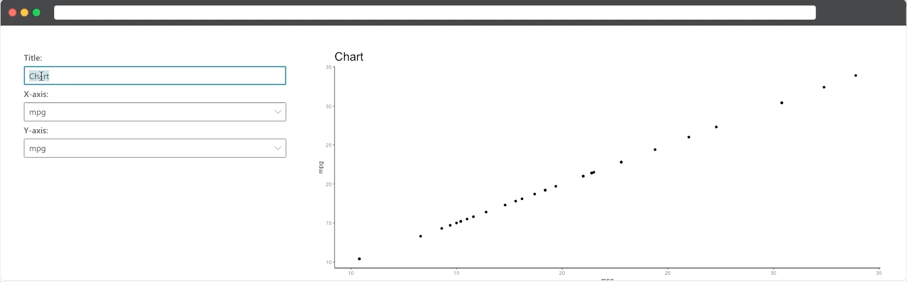

```{r, include = FALSE}
knitr::opts_chunk$set(
  collapse = TRUE,
  comment = "#>"
)
```

```{r setup}
library(shiny.fluent)
```

Let's start by creating something simple first - a dashboard allowing you to make a scatter plot displaying any two columns from the `mtcars` dataset. We'll also add the option for adding a custom title:

```
library(shiny.fluent)
library(ggplot2)

axisOptions <- list(
  list(key = "mpg", text = "mpg"), list(key = "cyl", text = "cyl"),
  list(key = "disp", text = "disp"), list(key = "hp", text = "hp"),
  list(key = "drat", text = "drat"), list(key = "wt", text = "wt"),
  list(key = "qsec", text = "qsec"), list(key = "vs", text = "vs"),
  list(key = "am", text = "am"), list(key = "gear", text = "gear"),
  list(key = "carb", text = "carb")
)

ui <- withReact(
  div(
    style = "display: flex; padding: 2rem",
    div(
      style = "width: 30vw; margin-right: 3rem",
      Label("Title:"),
      TextField(input_id = "displayTitle", value = "Chart"),
      Label("X-axis:"),
      Dropdown(input_id = "dropdownX", value = "mpg", options = axisOptions),
      Label("Y-axis:"),
      Dropdown(input_id = "dropdownY", value = "mpg", options = axisOptions)
    ),
    div(
      style = "width: 65vw",
      plotOutput(outputId = "chart")
    )
  )
)

server <- function(input, output) {
  output$chart <- renderPlot({
    colX <- sym(input$dropdownX)
    colY <- sym(input$dropdownY)
    ggplot(mtcars, aes(x = !!colX, y = !!colY)) +
      geom_point() +
      labs(title = input$displayTitle) +
      theme_classic() +
      theme(plot.title = element_text(size = 20))
  })
}

shinyApp(ui, server)
```




As you can see, `shiny.fluid` behaves almost identical to stock `shiny`, so it shouldn't take you much time to learn.

<br><br>