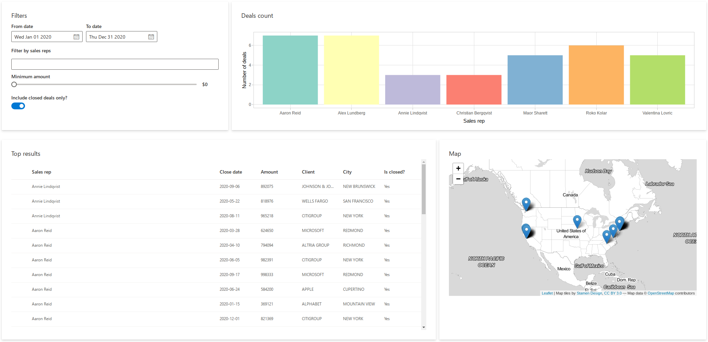

```{r, include = FALSE}
knitr::opts_chunk$set(
  collapse = TRUE,
  comment = "#>"
)
```

```{r setup, include=FALSE}
library(shiny.fluent)
library(tidyverse)
```

Let's learn shiny.fluent by building an example app.

In this tutorial, we'll build a basic application for analysing sales results data. The app will allow for filtering the data, and viewing in on a plot, on a map and in a table.

We'll assume that you have [Shiny](https://shiny.rstudio.com/) and `shiny.fluent` [already installed](https://appsilon.github.io/shiny.fluent/#installation).

# shiny.fluent "Hello world!" app

Let's start by creating an app that shows "Hello world!", but does this with Fluent UI. First, we need to load `shiny.fluent`.

```{r, include=FALSE, cache=FALSE}
# HACK: running via do.call because otherwise read_chunk breaks pkgdown::build_site (see https://github.com/r-lib/pkgdown/issues/1159)
do.call(knitr::read_chunk, list(path = "../inst/examples/tutorial/01_hello_world.R"))
do.call(knitr::read_chunk, list(path = "../inst/examples/tutorial/02_basic_app.R"))
do.call(knitr::read_chunk, list(path = "../inst/examples/tutorial/03_adding_filtering.R"))
do.call(knitr::read_chunk, list(path = "../inst/examples/tutorial/04_more_filters.R"))
do.call(knitr::read_chunk, list(path = "../inst/examples/tutorial/05_more_outputs.R"))
```


```{r helloworld-dependencies, eval=FALSE}
```

That gives us all we need to run a basic application! To create a UI showing a welcome message, we will use a Fluent component named `?Text`. Let's add it to our code.

For the text to actually appear, we need to put it inside a `withReact` function call. `withReact` takes care of rendering [Fluent components in user's browsers using React](). **TODO add link** Use `fluentPage` to create the UI, as it will add proper CSS classes and disable adding Bootstrap (you should not use both Bootstrap and Fluent UI at the same time).

```{r helloworld, eval=FALSE}
```

Let's see what our app looks like right now.

```{r, echo=FALSE}
knitr::include_graphics("images/01_hello_world.png")
```

Yay! It may not look very impressive, but this text is rendered in Shiny with the whole power of Fluent UI and [React](https://reactjs.org).

# Showing data in a table

Let's now grab some data and show them for our users in a nice, good looking table. shiny.fluent already includes some example data that we can use.

`fluent_people` is a list of imaginary people in a format expected by some Fluent components.

```{r}
fluent_people %>% glimpse()
```

`fluent_sales_data` is a data frame of randomly generated "sales deals", which are assigned to one of the `fluent_people`, have a date and an amount, and are associated with one of the top 10 companies from the Fortune 500 list (including its name, city and map coordinates).

```{r}
fluent_sales_deals %>% glimpse()
```

We now need a Fluent component to insert a table. A good way find a component that suits our needs is to go to [shiny.fluent components live demo](https://demo.appsilon.ai/apps/fluentui) or to thew [official Fluent UI docs](https://developer.microsoft.com/en-us/fluentui#/controls). Browsing through the list of components, we find `?DetailsList`, which gives a table component with rich configuration options.

First, we need to define which columns from our deals data we want to see and how to label them.
```{r details_list_columns, eval=FALSE}
```

Let's now display our sales deals in a table. As we plan to later make the table change dynamically, we put it in a regular Shiny `uiOutput`. Let's also assume that for now we want to filter out deals that have `is_closed` equal to `1`.

```{r deals_table, eval=FALSE}
```

As you can see, you can simply put `withReact` inside a `renderUI` in your server part. In some more advanced cases, you may need to use an [alternative mechanism](https://appsilon.github.io/shiny.fluent/articles/topic_embedding-react-in-shiny.html#reactoutput).

In addition to `DetailsList` and `Text`, in the code above we used `Stack`, which arranges elements in its area.


```{r, echo=FALSE}

```

# Adding filtering

Okay, that already looks good! But it's hard to explore these data without some filtering options - let's add that now.
We will start by adding an option to find transations between selected dates.

We will need two `DatePicker`s stacked together. They are shiny.fluent inputs, so behave in a very similar way to regular Shiny inputs: they expect an id as the first argument, and optionally an initial value.

```{r 03_filters_ui, eval=FALSE}
```

```{r 03_ui, eval=FALSE}
```

```{r 03_filters_server, eval=FALSE}
```

```{r, echo=FALSE}

```

# More filters

- NormalPeoplePicker
- Slider
- Toggle

```{r 04_helpers, eval=FALSE}
```

```{r 04_filters_ui, eval=FALSE}
```

```{r 04_ui, eval=FALSE}
```

```{r 04_table, eval=FALSE}
```

```{r, echo=FALSE}
knitr::include_graphics("images/04_more_filters.png")
```


# More outputs

- Plotly plot
- Leaflet Map

```{r 05_ui, eval=FALSE}
```

```{r 05_render, eval=FALSE}
```

```{r 05_outputs, eval=FALSE}
```

```{r, echo=FALSE}

```

# The End Result

*TODO* - a screenshot of the final app and a short summary what we learned.
