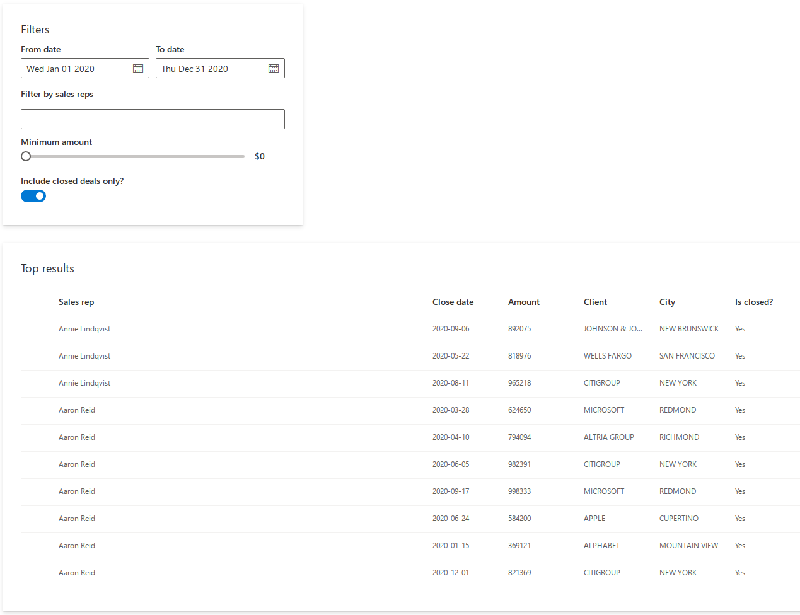

```{r, include = FALSE}
knitr::opts_chunk$set(
  collapse = TRUE,
  comment = "#>"
)
```

```{r setup, include=FALSE}
library(shiny.fluent)
library(tidyverse)
```

Let's learn shiny.fluent by building an example app.

In this tutorial, we'll build a basic application for analysing sales results data. The app will allow for filtering the data, and viewing it on a plot, on a map and in a table.

We'll assume that you have [Shiny](https://shiny.rstudio.com/) and `shiny.fluent` [already installed](https://appsilon.github.io/shiny.fluent/#installation).

# shiny.fluent "Hello world!" app

Let's start by creating an app that shows "Hello world!", but does this with Fluent UI. First, we need to load `shiny.fluent`.

```{r, include=FALSE, cache=FALSE}
# HACK: running via do.call because otherwise read_chunk breaks pkgdown::build_site (see https://github.com/r-lib/pkgdown/issues/1159)
do.call(knitr::read_chunk, list(path = "../inst/examples/tutorial/01_hello_world.R"))
do.call(knitr::read_chunk, list(path = "../inst/examples/tutorial/02_basic_app.R"))
do.call(knitr::read_chunk, list(path = "../inst/examples/tutorial/03_adding_filtering.R"))
do.call(knitr::read_chunk, list(path = "../inst/examples/tutorial/04_more_filters.R"))
do.call(knitr::read_chunk, list(path = "../inst/examples/tutorial/05_more_outputs.R"))
```


```{r helloworld-dependencies, eval=FALSE}
```

That gives us all we need to run a basic application!
To create a UI showing a welcome message, we will use a Fluent component named `?Text`.
We'll put it in a `?fluentPage`,
which will add proper CSS classes and suppress Bootstrap
(you should not use both Bootstrap and Fluent UI at the same time).

```{r helloworld, eval=FALSE}
```

Let's see what our app looks like right now.

```{r, echo=FALSE}

```

Yay! It may not look very impressive, but this text is rendered in Shiny with the whole power of Fluent UI and [React](https://reactjs.org).

# Showing data in a table

Let's now grab some data and show it to our users in a table.
shiny.fluent already includes some example data that we can use.

`fluentPeople` is a list of imaginary people in a format expected by some Fluent components.

```{r}
fluentPeople %>% glimpse()
```

`fluentSalesData` is a data frame of randomly generated "sales deals", which are assigned to one of the `fluentPeople`, have a date and an amount, and are associated with one of the top 10 companies from the Fortune 500 list (including its name, city and map coordinates).

```{r}
fluentSalesDeals %>% glimpse()
```

We now need a Fluent component to insert a table. A good way find a component that suits our needs is to go to [shiny.fluent components live demo](https://demo.appsilon.ai/apps/fluentui) or to the [official Fluent UI docs](https://developer.microsoft.com/en-us/fluentui#/controls). Browsing through the list of components, we find `?DetailsList`, which gives a table component with rich configuration options.

First, we need to define which columns from our deals data we want to see and how to label them.
```{r details_list_columns, eval=FALSE}
```

Let's now display our sales deals in a table. As we plan to later make the table change dynamically, we put it in a regular Shiny `uiOutput`. Let's also assume that for now we want to filter out deals that have `is_closed` equal to `1`.

```{r deals_table, eval=FALSE}
```

In addition to `?DetailsList` and `?Text`, in the code above we used `?Stack`, which arranges elements in its area.


```{r, echo=FALSE}
knitr::include_graphics("images/tutorial-part1-step2.png")
```

# Adding filtering

Okay, that already looks good! But it's hard to explore these data without some filtering options - let's add that now.
We will start by adding an option to find transactions between selected dates.

We will use two `?DatePicker` components to allow users to choose a date range.
To make the selected dates available in the server function, we have two options:

1. The simple way.
  Use the `DatePicker.shinyInput` convenience wrapper,
  which provides an interface analogous to vanilla Shiny inputs: `inputId` and optional `value`.
2. The advanced way.
  Use the component directly and connect it to Shiny using its React interface:
  `onSelectDate` and `defaultValue` in this case.

The second option is less convenient but might provide more power and flexibility in some cases.
We'll go with the first option in this tutorial,
as the simplified interface is sufficient for our needs.

```{r 03_filters_ui, eval=FALSE}
```

Let's add the filters to our UI:

```{r 03_ui, eval=FALSE}
```

In the server function of our application,
we can now access the input values using the IDs we provided
in the same way as with any other Shiny input.
Let's use the selected dates to apply additional filtering to the deals:

```{r 03_filters_server, eval=FALSE}
```

This is what our application looks like now:

```{r, echo=FALSE}
knitr::include_graphics("images/tutorial-part1-step3.png")
```

# More filters

Let's add more filtering options to our app!
We will use the following components:

- [`?NormalPeoplePicker`](../reference/PeoplePicker.html) to limit the search to selected sales representatives,
- `?Slider` to define a minimum deal size,
- `?Toggle` to show only the closed deals.

In addition we'll use `?Stack` and `?Label` to visually arrange the filtering controls.

```{r 04_filters_ui, eval=FALSE}
```

Now that we have multiple filtering controls,
it would be a good idea to add some visual separation between them and the table.
Let's define a helper function to create Fluent UI cards:

```{r 04_helpers, eval=FALSE}
```

Now we can wrap the filters in a call to `makeCard()`.
Additionally, we include a `style` tag
to add some padding and margin to the cards created by our helper function.

```{r 04_ui, eval=FALSE}
```

Let's move our attention to the server function.
We can access the values of the filtering controls using the provided IDs just like before.

```{r 04_filters_server, eval=FALSE}
```

Finally, let's refactor the table output and wrap it in a card.

```{r 04_table, eval=FALSE}
```

Our filtering is much more useful now!

```{r, echo=FALSE}

```


# More outputs

We are not limited to shiny.fluent components - we can seamlessly use other libraries in our app!
Let's add a Plotly plot and a Leaflet map.
We start by adding a `plotlyOutput()` to our UI:

```{r 05_ui, eval=FALSE}
```

We also add a `leafletOutput()` to the UI generated in the server function:

```{r 05_outputs, eval=FALSE}
```

Now we can add the following code to the server function to render a bar chart and a map:

```{r 05_render, eval=FALSE}
```

Look at our dashboard now!

```{r, echo=FALSE}
knitr::include_graphics("images/tutorial-part1-step5.png")
```

# The end result

In this tutorial we built a simple dashboard for exploring sales representatives data.
We learned how to use shiny.fluent inputs and outputs,
how to add components from other libraries
and how to use Fluent UI capabilities for visually arranging the elements.
