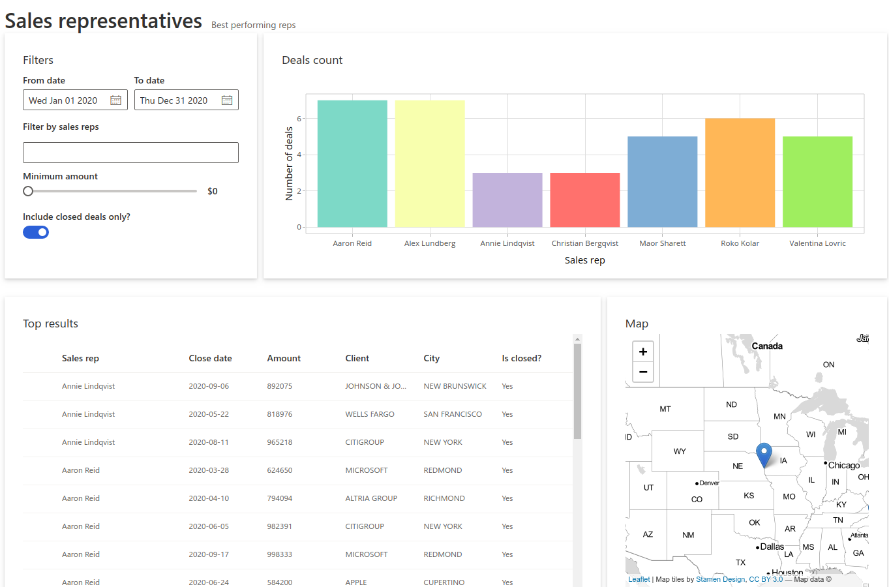
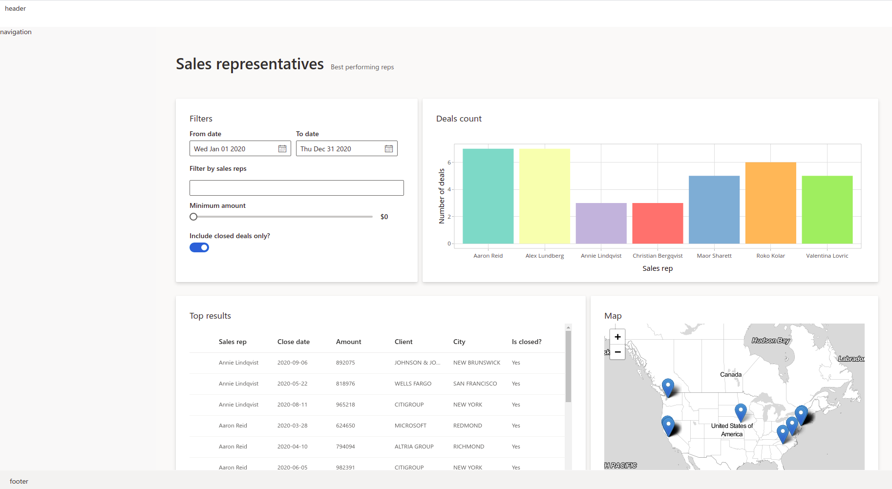
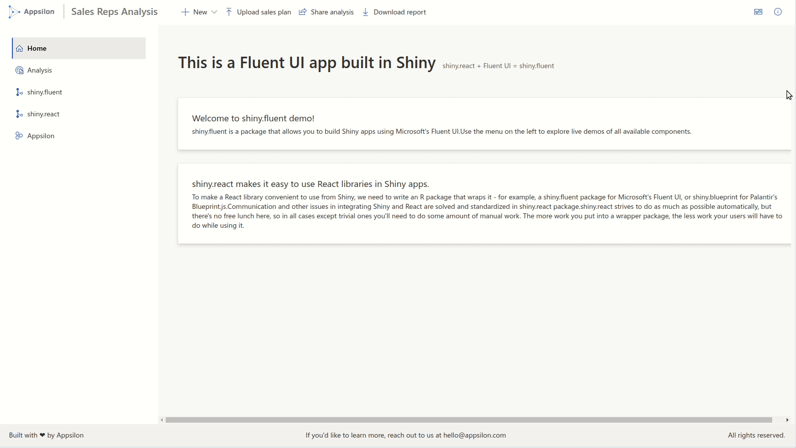

```{r, include = FALSE}
knitr::opts_chunk$set(
  collapse = TRUE,
  comment = "#>"
)
```

```{r setup}
library(shiny.fluent)
```

```{r, include=FALSE, cache=FALSE}
do.call(knitr::read_chunk, list(path = "../inst/examples/tutorial/dashboard_layout.R"))
```

This is Part 2 of shiny.fluent tutorial.

In [Part 1](../articles/shiny-fluent.html) we built a pretty functional app, but honestly, it doesn't look particularly great. Let's now build a good looking dashboard UI for that app. It will have a top command bar with a title, a sidebar with navigation, and multiple pages handled by router.

# Prerequisites

We are starting with the [code Part 1 ends with](https://appsilon.github.io/shiny.fluent/articles/shiny-fluent.html).

Let's start by changing the beginning of our file to load all libraries that we will use in this example. Make sure to install the ones you don't have yet installed (if any).

```{r libraries, eval=FALSE}
```

# Single page layout

As a next step, let's add a title and subtitle to our current app. We'll create a helper function and call it `makePage`, so that it is easy to add more pages in the same fashion.


```{r make-page, eval=FALSE}
```

We can now take our entire UI built so far and put it in a "page" layout, giving it a helpful title and subtitle.

```{r analysis-page, eval=FALSE}
```


```{r, echo=FALSE}

```

# Dashboard Layout

It's time to create a place for our header, navigation sidebar and footer. We'll use CSS grid for that. It's a modern, flexible and staightforward way to achieve such a layout.

We start by creating divs for each of the areas, with placeholder texts that we will later replace.

```{r layout, eval=FALSE}
```

Now it's time to tell the browser using CSS how to arrange these areas. To define how our areas should be laid out on the page, let's put the following rules in `www/style.css`:

```css
.grid-container {
  display: grid;
  grid-template-columns: 320px 1fr;
  grid-template-rows: 54px 1fr 45px;
  grid-template-areas: "header header" "sidenav main" "footer footer";
  height: 100vh;
}

.header {
  grid-area: header;
  background-color: #fff;
  padding: 6px 0px 6px 10px;
  display: flex;
}

.main {
  grid-area: main;
  background-color: #faf9f8;
  padding-left: 40px;
  padding-right: 32px;
  max-width: calc(100vw - 400px);
  max-height: calc(100vh - 100px);
  overflow: auto;
}

.footer {
  grid-area: footer;
  background-color: #f3f2f1;
  padding: 12px 20px;
}

.sidenav {
  grid-area: sidenav;
  background-color: #fff;
  padding: 25px;
}

```

We can also use this opportunity to add some additional styling for the entire page, and add the following rules to the same file:

```css
body {
  background-color: rgba(225, 223, 221, 0.2);
  min-height: 611px;
  margin: 0;
}

.page-title {
  padding: 52px 0px;
}

.card {
  background: #fff;
  padding: 28px;
  margin-bottom: 28px;
  border-radius: 2px;
  background-clip: padding-box;
}
```

Now we only need to update our UI definition to load styles from `www/style.css` and use the new layout.

```{r basic-layout-ui, eval=FALSE}
```


```{r, echo=FALSE}

```

# Filling all the areas

Great! Now it's time to fill those areas with something. We can start with the header.

## Header

Let's replace the previous header definition with:

```{r header, eval=FALSE}
```

As you can see, we're using `CommandBar` and `CommandBarItem` from shiny.fluent. We also need to add a bit of styling to our CSS file:

```css

.title {
  padding: 0px 14px 0px 14px;
  color: #737373;
  margin: 6px 0px 6px 10px;
  border-left: 1px solid darkgray;
  width: 220px;
}

.logo {
  height: 44px;
}
```

## Navigation in the sidebar

`Nav` is a very powerful component from Fluent UI. It has very rich configuration options, but we will use it to show just a couple of links:

```{r navigation, eval=FALSE}
```

## Footer

Footer is relatively straightforward - we can put anything we want there. Here we use `Text` for typography (setting uniform font styling). We also use `Stack` to arrange elements horizontally and with bigger gaps.

```{r footer, eval=FALSE}
```

Let's see how this looks together.

```{r, echo=FALSE}

```

# Additional pages

## Home page

The one final step is to add additional pages. Let's make a home page, consisting of two cards with some welcome text.

```{r home-page, eval=FALSE}
```


If we replace `analysis_page` with `home_page` in our `ui`, we can even see this page. However, there's one problem: we don't have a way to switch between pages! This is where so-called page routing comes into play.


## Adding shiny.router

To enable switching between pages we will use the [shiny.router](https://appsilon.github.io/shiny.router/) package. This way we will also have shareable URLs to individual pages.

The first step is to define the available routes:

```{r router, eval=FALSE}
```

Now, we need to put `router$ui` in the place where we want the selected page to appear. (Currently, we also need to manually include router's JavaScript dependencies, because `shiny.fluent` is not compatible with the way `shiny.router` loads this dependency. We expect this to be resolved in future versions of `shiny.router`).

```{r router-ui, eval=FALSE}
```

One final step is to add this single line to our `server` function, which otherwise remains untouched from the Part 1 of the tutorial.

```{r router-server, eval=FALSE}
```

# That's it!

That's it - we have styled a shiny.fluent app into a solid dashboard layout!

Here's the final result:

```{r, echo=FALSE}

```
